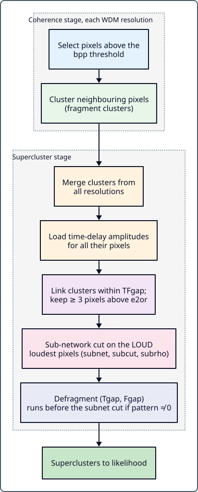

.. _clustering_algorithm:

Clustering Algorithm
====================

.. stage-nav:: search
   :current: clusters

This guide describes pycWB's pixel clustering and superclustering algorithms,
including the configurable parameters that control how time-frequency pixels
are grouped into candidate events.

.. contents:: Table of Contents
   :depth: 2
   :local:

Why this matters
----------------

The clustering stage decides which time-frequency pixels are grouped into a
candidate event. Most users do not need to modify clustering parameters for
a standard search, but these settings affect background rate, sensitivity,
and glitch rejection. Tune only if you understand the trade-offs.

Overview
--------

After pixel selection identifies excess-power pixels in each WDM
time-frequency map, pycWB groups these pixels into **clusters** and then
merges nearby clusters into **superclusters**. The superclustering step is
critical: it determines which pixel groups are treated as a single
gravitational-wave candidate for likelihood evaluation.

Per-resolution clustering is part of
:py:mod:`pycwb.modules.coherence_native`
(:py:func:`~pycwb.modules.coherence_native.clustering.cluster_pixels`);
superclustering, the sub-network cut and defragmentation live in
:py:mod:`pycwb.modules.super_cluster_native`. The
:py:mod:`pycwb.modules.clustering` package is scaffolding for future
algorithms (DBSCAN, HDBSCAN, OPTICS, etc.) and has no implementation yet.

In the cWB-2G stage names, single-resolution clustering happens during the
``Coherence`` stage after significant pixels are selected. The
``Supercluster`` stage then merges those per-resolution clusters into one
list, loads time-delay amplitudes for all of their pixels, links them into
superclusters, applies the sub-network cut, and defragments the result
(defragmentation runs before the sub-network cut when ``pattern ≠ 0``).
pycWB preserves this division even though the data now flows through Python
objects rather than ROOT job-file cycles.

Pipeline: From Pixels to Fragment Clusters
------------------------------------------

The clustering pipeline proceeds through these steps:

1. **Pixel Selection** — excess power pixels are selected above a threshold
   in the time-frequency plane.
2. **Per-Resolution Clustering** — pixels at each WDM resolution level are
   clustered independently.
3. **Multi-Resolution Merging** — clusters from all resolution levels are
   collected into one list.
4. **Time-Delay Amplitudes** — delayed pixel amplitudes are loaded for the
   merged clusters.
5. **Superclustering** — clusters closer than ``TFgap`` in time-frequency are
   linked into superclusters; superclusters, including unlinked single
   clusters, with fewer than 3 pixels or energy below ``e2or`` are dropped.
6. **Sub-Network Cut** — per-sky-direction threshold cuts are applied to
   remove accidental coincidences.
7. **Defragmentation** — superclusters within ``Tgap`` and ``Fgap`` are
   merged. With the default ``pattern = 0`` this runs after the sub-network
   cut; with ``pattern ≠ 0`` it runs before it.

The output of this stage is the set of surviving multi-resolution
superclusters. Those are the candidate structures that the likelihood stage
will scan over sky position and reconstruct as events.

The high-level wrapper is
:py:func:`pycwb.modules.super_cluster_native.super_cluster.supercluster_wrapper`,
which calls
:py:func:`pycwb.modules.super_cluster_native.super_cluster.setup_supercluster`
once at initialization and
:py:func:`pycwb.modules.super_cluster_native.super_cluster.supercluster_single_lag`
for each lag.

Pixel Selection
---------------

Selection uses energy only; no network correlation enters at this stage.
For each detector, the time-frequency map is replaced by its maximum pixel
energy over time shifts within the network light-travel time
(cWB-2G ``maxEnergy``). For each lag, the lag-shifted detector maps are summed
into a network energy :math:`E(t,f)`:

- pixels with :math:`E < E_o` are discarded and values are clipped at
  :math:`2E_o`;
- a pixel at or above :math:`2E_o` is kept on its own;
- a pixel between :math:`E_o` and :math:`2E_o` is kept only with neighbour
  support: one of the products of :math:`E` with its summed neighbour energies
  must reach :math:`(2E_o)^2`.

The threshold :math:`E_o` is set from the black-pixel probability ``bpp``.
For ``pattern = 0`` it averages the empirical ``bpp`` upper quantile of the
summed map with the ``bpp`` quantile of a Gamma model fitted to it
(:py:func:`~pycwb.modules.coherence_native.veto_threshold.compute_threshold`);
``pattern ≠ 0`` uses a separate Gamma fit. The kept pixels are then clustered
at the current WDM resolution: neighbours within one pixel in time and
frequency (``pattern = 0``), or within 2 time bins and 3 frequency bins
(``pattern ≠ 0``), are joined by union-find.

Key parameters controlling pixel selection:

.. list-table::
   :header-rows: 1
   :widths: 22 15 63

   * - Parameter
     - Default
     - Description
   * - ``bpp``
     - 0.001
     - Black-pixel probability used to set the energy threshold :math:`E_o`
   * - ``pattern``
     - 0
     - Pixel pattern: 0 = single pixel, 1–9 = multi-pixel packet shapes (other
       non-zero values act as a single-pixel packet); the sign selects the
       likelihood flavour (< 0 likelihood2G, > 0 likelihoodWP)
   * - ``select_subrho``
     - 5.0
     - Fragment-cluster ``subrho`` cut in the Coherence stage (``pattern ≠ 0`` only)
   * - ``select_subnet``
     - 0.1
     - Fragment-cluster ``subnet`` cut in the Coherence stage (``pattern ≠ 0`` only)

Superclustering Algorithm
-------------------------

The superclustering algorithm
(:py:func:`pycwb.modules.super_cluster_native.super_cluster.supercluster`)
merges pixel clusters that are close in time and frequency:

1. **Build pixel matrix**: For all input clusters, construct a compact feature
   matrix with these columns per pixel:

   - Central time (normalized by rate × layer)
   - Frequency index × rate (twice the pixel frequency in Hz)
   - Inverse rate (:math:`1 / \text{rate}`)
   - Half-rate (:math:`\text{rate} / 2`)
   - Parent cluster ID
   - Per-interferometer pixel times in seconds

2. **Find cluster links**: Using
   :py:func:`~pycwb.modules.super_cluster_native.utils.get_cluster_links`,
   identify pairs of clusters that have at least one pixel pair within the
   time-frequency gap threshold.

3. **Union-Find merging**: Linked clusters are merged using a Numba
   JIT-compiled union-find data structure with path compression and
   union-by-rank
   (:py:func:`~pycwb.modules.super_cluster_native.utils.aggregate_clusters_from_links`).

4. **Compute supercluster statistics**: For each merged supercluster,
   calculate the centroid time and frequency, the rates of the dominant and
   secondary resolutions, and the total energy; then drop superclusters with
   fewer than 3 pixels or with the largest per-resolution energy sum below
   ``e2or``.

The gap threshold for linking is controlled by ``TFgap``. Two pixels
:math:`p, q` from different clusters, with WDM rates :math:`r_p, r_q`
(pixel rate :math:`= 1/\Delta t`) and :math:`\max(r_p/r_q, r_q/r_p) \le 3`,
link their clusters when

.. math::

   \max(\delta t, 0)\,(r_p + r_q) + \max(\delta f, 0)\left(\frac{1}{r_p} + \frac{1}{r_q}\right) \le \text{TFgap},

with :math:`\delta t = \max_k |t_{p,k} - t_{q,k}| - \tfrac12(1/r_p + 1/r_q)`
(largest per-detector time separation) and
:math:`\delta f = |2f_p - 2f_q| - \tfrac12(r_p + r_q)`. Both terms are gaps
measured in units of pixel size, so ``TFgap`` counts pixels. Links are
transitive: one qualifying pixel pair merges whole clusters.

Sub-Network Cut
---------------

The sub-network cut
(:py:func:`pycwb.modules.super_cluster_native.utils.apply_subnet_cut`) decides
once per supercluster whether it is kept:

- It uses the ``LOUD`` loudest pixels of the supercluster and scans a coarse
  sky (HEALPix order capped at ``MIN_SKYRES_HEALPIX``) with delays on the
  analysis-rate grid.
- ``subcut`` is a per-direction pre-filter: directions where the
  sub-network fraction :math:`(a-m)/(a+m)` is below ``subcut`` are skipped
  (a negative ``subcut`` disables this filter).
- At the direction with the largest sub-network statistic, an MRA/XTalk step
  gives the final values. The supercluster passes when
  :math:`\min(\text{suball}, \text{submra}) > \text{subnet}`,
  :math:`\rho_{\rm sub} > |\text{subrho}|` and
  :math:`E_m > \text{subnorm}\cdot E_o`.
- The cut is Numba-accelerated and handles cross-talk (XTalk) pixel lookups
  internally.

This mirrors the cWB-2G ``network::subNetCut`` role: reject sub-threshold
network structures before the expensive full likelihood reconstruction. When
``subrho`` or ``subacor`` are not explicitly set, pycWB follows the same
fallback pattern by using the main ``netRHO`` or ``Acore`` thresholds.

Parameters controlling the sub-network cut:

.. list-table::
   :header-rows: 1
   :widths: 22 15 63

   * - Parameter
     - Default
     - Description
   * - ``subnet``
     - 0.7
     - Sub-network coherence threshold :math:`\in [0, 0.7]`
   * - ``subcut``
     - 0.33
     - Sub-network pre-filter in the sky loop :math:`\in [0, 1]`; < 0 disables it
   * - ``subnorm``
     - 0.0
     - Sub-network norm threshold (enabled if > 0) :math:`\in [0, 2 \times nRes]`
   * - ``subrho``
     - 0.0
     - Sub-network sky loop rho threshold (≤ 0 → uses ``netRHO``)
   * - ``subacor``
     - 0.0
     - Sub-network sky loop Acore threshold (≤ 0 → uses ``Acore``)
   * - ``LOUD``
     - 200
     - Loudest pixels per supercluster used in the sub-network cut
   * - ``MIN_SKYRES_HEALPIX``
     - 4
     - Maximum HEALPix order of the sub-network sky scan

When ``subrho`` ≤ 0, the standard ``netRHO`` threshold is used for the
sub-network cut. Similarly, ``subacor`` ≤ 0 falls back to ``Acore``.

Defragmentation
---------------

After superclustering, a defragmentation pass
(:py:func:`pycwb.modules.super_cluster_native.super_cluster.defragment`)
merges superclusters that have a pixel pair (rate ratio ≤ 3) within ``Tgap``
in time and ``Fgap`` in frequency, both measured edge to edge.

With the default ``pattern = 0`` this cleanup runs after the sub-network cut,
as in the cWB-2G flow, so that nearby surviving fragments are presented to
likelihood as a single candidate structure. With ``pattern ≠ 0`` it runs
before the sub-network cut.

.. list-table::
   :header-rows: 1
   :widths: 22 15 63

   * - Parameter
     - Default
     - Description
   * - ``Tgap``
     - 3.0 s
     - Defragmentation time gap—clusters within this time are merged
   * - ``Fgap``
     - 130 Hz
     - Defragmentation frequency gap—clusters within this frequency are merged

``TFgap`` (default 6) is used only for supercluster linking, not here.

Time-Delay Precomputation
-------------------------

At setup time
(:py:func:`pycwb.modules.super_cluster_native.super_cluster.setup_supercluster`),
the time-delay range is precomputed:

.. math::

   K_{td} = \max(TDSize \times upTDF,\ \lfloor \text{max\_delay} \times TDRate \rfloor + 1)

:math:`K_{td}` is the half-range of the delay grid: each pixel stores
:math:`2K_{td}+1` delayed amplitudes per quadrature, used for the
sky-dependent time shifts in likelihood evaluation. The sub-network cut uses
a separate range at the analysis rate,
:math:`K_{\rm subnet} = \max(TDSize,\ \lfloor \text{max\_delay} \times \text{rateANA} \rfloor + 1)`.

Related parameters: ``TDSize`` (default 12, max 20), ``upTDF`` (default 4,
upsample factor for TD filter rate).

Usage Guidance
--------------

For standard users
~~~~~~~~~~~~~~~~~~

You likely don't need to change any clustering parameters. The defaults are
chosen for general-purpose burst searches. If you must tune:

- ``TFgap``: increase to merge more pixels (fewer, larger clusters); decrease
  to split clusters (more, smaller events).
- ``Tgap`` / ``Fgap``: control defragmentation. Larger values merge more.

For advanced users
~~~~~~~~~~~~~~~~~~

Tune these only if you understand the impact on background and sensitivity:

- ``subnet``, ``subcut``, ``subrho``, ``subacor``: sub-network cut thresholds.
  Higher values are more selective (fewer clusters, lower background, but may
  reject real signals).
- ``bpp``: black pixel probability. Lower = fewer pixels selected. Affects
  sensitivity to short-duration signals.
- ``pattern``: multi-pixel packet mode. Non-zero values compute energies over
  fixed multi-pixel packet shapes, widen the clustering neighbourhood, and
  enable the Coherence-stage ``select_subrho``/``select_subnet`` cuts. This
  helps for extended signals but can merge distinct events.

Developer notes
~~~~~~~~~~~~~~~

.. admonition:: Implementation detail
   :class: note

   The clustering code is Numba JIT-compiled for performance. Key internals:

   - ``_build_link_pixel_matrix`` constructs the feature matrix from
     ``PixelArrays`` (struct-of-arrays layout).
   - Union-find uses path compression + union-by-rank for :math:`O(\alpha(N))`
     merging.
   - Sub-network cut precomputes two HEALPix sky arrays: full resolution (for
     likelihood) and capped (``MIN_SKYRES_HEALPIX``, for the cut).

Config Quick Reference
----------------------

.. list-table:: Clustering & Superclustering Parameters
   :header-rows: 1
   :widths: 25 15 60

   * - Parameter
     - Default
     - Description
   * - ``bpp``
     - 0.001
     - Black pixel selection probability
   * - ``BATCH``
     - 10000
     - Max loudest pixels per cluster passed to likelihood (0 = no limit)
   * - ``LOUD``
     - 200
     - Loudest pixels per supercluster used in the sub-network cut
   * - ``pattern``
     - 0
     - Pixel pattern (0 = single, 1–9 = packets)
   * - ``TFgap``
     - 6.0
     - TF pixel separation for cluster linking
   * - ``Tgap``
     - 3.0
     - Defragmentation time gap [s]
   * - ``Fgap``
     - 130
     - Defragmentation frequency gap [Hz]
   * - ``subnet``
     - 0.7
     - Sub-network threshold
   * - ``subcut``
     - 0.33
     - Sub-network skyloop threshold
   * - ``subnorm``
     - 0.0
     - Sub-network norm threshold
   * - ``subrho``
     - 0.0
     - Sub-network skyloop rho
   * - ``subacor``
     - 0.0
     - Sub-network skyloop Acore
   * - ``select_subnet``
     - 0.1
     - Coherence-stage subnet cut (``pattern ≠ 0``)
   * - ``select_subrho``
     - 5.0
     - Coherence-stage subrho cut (``pattern ≠ 0``)
   * - ``TDSize``
     - 12
     - Time-delay filter size (max 20)
   * - ``upTDF``
     - 4
     - Upsample factor for TD filter rate

.. raw:: html

   

Inspect clusters
----------------

Inspect the selected pixels and cluster boundaries when changing clustering
settings. ``TFgap`` links pixel pairs transitively, so the outermost pixels of
a supercluster can be far apart. ``Tgap`` and ``Fgap`` can merge nearby
structures further during defragmentation.

Compare the same data before and after a parameter change to see which
structures split or merge, and how those changes affect recovered events.

----

**See also:** :doc:`pipeline_lifecycle` · :doc:`likelihood_guide` · :doc:`job_control`

**Next:** :doc:`likelihood_guide` — how candidate events are scored
