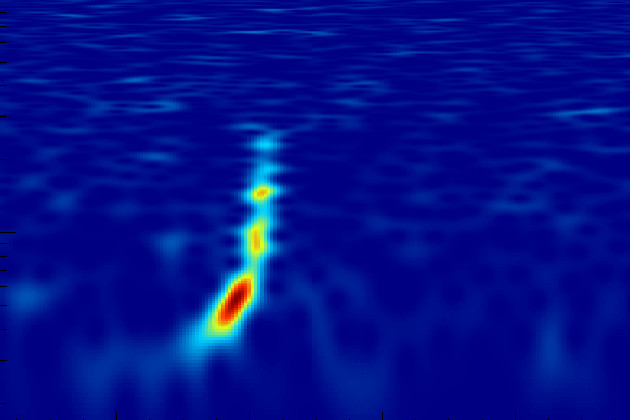
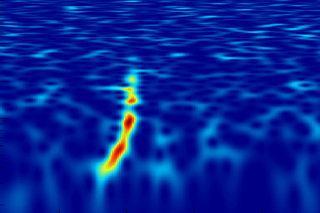
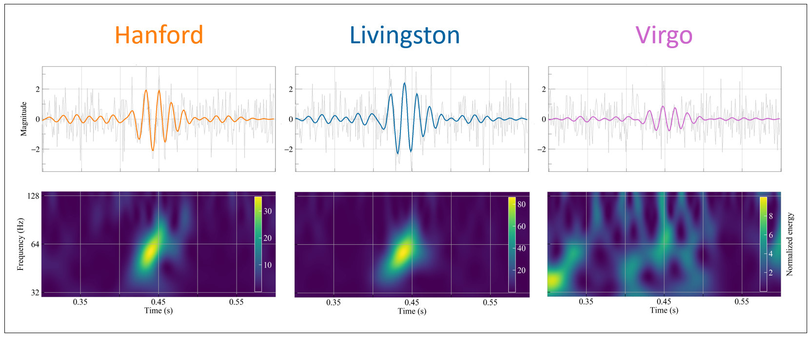

.. _cwb_heritage:

Migration from cWB
==================

pycWB is a Python implementation of the coherent WaveBurst (cWB/cWB-2G)
search algorithms, the wavelet-based pipeline for unmodeled gravitational-wave
transient searches. This page explains how public cWB documentation and
ROOT/C++ cWB workflows map to the current pycWB documentation.

.. note::

   The public cWB pages describe the ROOT/C++ cWB software and commands such
   as ``cwb_gwosc``. They remain useful scientific references, but pycWB users
   should follow the current pycWB commands in :ref:`start_here`,
   :ref:`standard_analysis`, and :ref:`cli_reference`.

What cWB Contributed
--------------------

Coherent WaveBurst searches for short gravitational-wave transients with
minimal assumptions about the signal waveform. The algorithmic chain transforms
detector strain data into WDM time-frequency maps, identifies coherent excess
power across the detector network, builds pixel clusters and multi-resolution
superclusters, and uses a coherent likelihood to distinguish astrophysical
candidates from incoherent noise.

cWB has been used throughout LIGO, Virgo, and KAGRA transient analyses. The
public documentation is valuable because it records examples, GWTC waveform
reconstructions, CED galleries, and citation guidance that still help users
understand the same algorithms that pycWB implements in Python.

Flavors of cWB
--------------

.. list-table::
   :header-rows: 1
   :widths: 20 40 40

   * - Flavor
     - Role
     - Relation to pycWB
   * - cWB-2G
     - The standard coherent WaveBurst pipeline, historically implemented in
       ROOT/C++ and used for LVK burst searches and public GWTC
       reconstructions.
     - pycWB implements the same search algorithms while moving the workflow,
       configuration, module boundaries, and postproduction tooling into a
       Python package.
   * - pycWB
     - A modular Python framework for coherent burst searches, with YAML
       configuration, native Python/JAX/Numba modules, improved injection
       support, and streamlined postproduction.
     - This is the software documented here: the cWB-2G algorithmic chain
       expressed as a modular Python workflow. Start with :ref:`start_here` for
       a runnable example.
   * - cWB-XP
     - A separate cWB branch. It keeps the ROOT/C++ framework but changes the
       core transform/statistic by using a multi-resolution WaveScan transform
       and a cross-power statistic.
     - It is useful comparison context, but it is not pycWB and is not covered
       by the pycWB user guide.

Public Examples
---------------

GW150914
~~~~~~~~

GW150914 was the first gravitational-wave event. The public cWB material notes
that the low-latency cWB search identified the event and preserves public
time-frequency displays and CED links.

   GW150914 time-frequency map in Hanford data, copied from the public cWB
   site.

   GW150914 time-frequency map in Livingston data, copied from the public cWB
   site.

Useful public links:

* `GW150914 LVK public page <https://www.ligo.org/science/Publication-GW150914/index.php>`_
* `GW150914 cWB report <https://gwburst.gitlab.io/public/analysis/gwtc1-waveform-reconstructions/events/GW150914/report/all/index.html>`_
* `GW150914 CED page <https://gwburst.gitlab.io/info/gw150914_ced_gwosc/>`_

GW190521
~~~~~~~~

GW190521 is a public example where cWB reconstruction is useful for visualizing
a short, high-mass binary black-hole signal and its time-frequency structure.

   GW190521 public cWB display copied from the public cWB site.

Useful public links:

* `GW190521 LVK public page <https://www.ligo.org/science/Publication-GW190521/index.php>`_
* `GW190521 cWB report <https://gwburst.gitlab.io/public/analysis/gwtc2-waveform-reconstructions/events/S190521g/report/all/index.html>`_

GW190814
~~~~~~~~

The public cWB material also points to cWB contributions to higher-order-mode
studies of GW190814. In the pycWB docs, use this mainly as scientific context:
the mechanics of configuring searches, running jobs, and postproduction are
covered by the current pycWB guides.

Useful public links:

* `GW190814 LVK public page <https://www.ligo.org/detections/GW190814.php>`_
* `cWB public material for GW190814 higher-order modes <https://dcc.ligo.org/public/0166/T2000124/007/cWB_public.pdf>`_

Mapping cWB Concepts to pycWB
-----------------------------

.. list-table::
   :header-rows: 1
   :widths: 30 35 35

   * - cWB concept
     - pycWB location
     - Notes
   * - ``user_parameters.C``
     - :ref:`schema`, :ref:`standard_analysis`
     - pycWB uses YAML configuration rather than ROOT macros.
   * - ``cwb_gwosc``
     - :ref:`cli_reference`, :ref:`config_repository`
     - Treat this as a ROOT/C++ cWB command. pycWB has separate GWOSC helpers
       and normal searches run through ``pycwb run``.
   * - Wavelet transform, pixels, clusters, likelihood
     - :ref:`pipeline_lifecycle`, :ref:`clustering_algorithm`,
       :ref:`likelihood_guide`
     - These pages explain how pycWB implements the same cWB/cWB-2G
       algorithmic stages in the current Python workflow.
   * - CED event displays
     - :ref:`public_gwtc_references`, :ref:`postproduction`
     - Public CED pages remain useful references. pycWB output is organized
       around Parquet catalogs, trigger files, plots, and postproduction
       reports.
   * - GWTC cWB waveform reconstructions
     - :ref:`public_gwtc_references`
     - Keep the public reports external and use the pycWB docs as a guide to
       current workflows.
   * - ROOT/C++ implementation details
     - :ref:`modules_guide`, :ref:`dev_cxx_core`
     - Some ROOT-backed modules are retained for interoperability or
       comparison, while native pycWB modules are the preferred path for new
       development.

Where to Go Next
----------------

* Use :ref:`start_here` for a first pycWB run.
* Use :ref:`pipeline_lifecycle` to understand the current pipeline stages.
* Use :ref:`modules_guide` to find the Python modules corresponding to cWB
  components.
* Use :ref:`public_gwtc_references` to find public GWTC cWB reconstruction and
  CED links.
