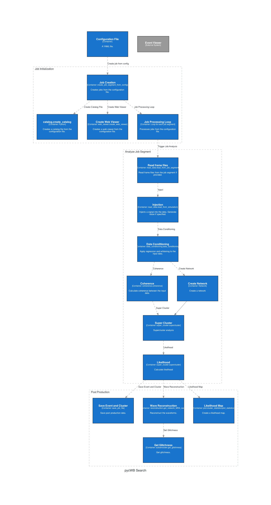

.. pycWB documentation master file, created by
   sphinx-quickstart on Wed Mar  8 13:16:45 2023.
   You can adapt this file completely to your liking, but it should at least
   contain the root `toctree` directive.

Welcome to pycWB's documentation!
===================================

.. image:: https://readthedocs.org/projects/pycwb/badge/?version=latest
   :target: https://pycwb.readthedocs.io/en/latest/
   :alt: Documentations

.. image:: https://git.ligo.org/yumeng.xu/pycwb/badges/main/pipeline.svg
   :target: https://git.ligo.org/yumeng.xu/pycwb/-/pipelines
   :alt: Build Status

.. image:: https://git.ligo.org/yumeng.xu/pycwb/-/badges/release.svg
   :target: https://git.ligo.org/yumeng.xu/pycwb/-/releases
   :alt: Releases

.. image:: https://badge.fury.io/py/pycWB.svg
   :target: https://badge.fury.io/py/pycWB
   :alt: PyPI version

.. image:: https://img.shields.io/badge/license-GPLv3-blue
   :target: https://git.ligo.org/yumeng.xu/pycwb/-/blob/main/LICENSE
   :alt: License

pycWB is a modularized Python package for gravitational wave burst search based on the core function of cWB.

.. toctree::
   :hidden:
   :maxdepth: 5

   install
   credit
   pycWB <modules>
   genindex

.. toctree::
   :hidden:
   :caption: User Guides
   :maxdepth: 1

   tutorials
   schema

.. toctree::
   :hidden:
   :caption: Developer Guides
   :maxdepth: 1

   mod_cwb

Getting Started
===============

Installation
------------

PycWB is available on `PyPI <https://pypi.org/project/pycWB/>`_. You can install it with pip.
Some dependencies are required to be installed before installing pycWB with pip.
The easiest way is to install them with conda.

.. code-block:: bash

   conda create -n pycwb "python>=3.9,<3.11"
   conda activate pycwb
   conda install -c conda-forge root=6.26.10 healpix_cxx=3.81 nds2-client python-nds2-client lalsuite setuptools_scm cmake pkg-config
   python3 -m pip install pycwb

Run your first burst search
---------------------------

In your first burst search, we will use a built-in noise generator and waveform generator
to minimize the requirement for external data. What you need is just one configuration file in YAML format.

To start with, copy the example configuration folder from the source code or download the
``user_parameters_injection.yaml`` manually from `here <https://git.ligo.org/yumeng.xu/pycwb/-/blob/main/examples/injection/user_parameters_injection.yaml>`_.

.. code-block:: bash

    cp -r [path_to_source_code]/examples/injection my_first_search

Now, you are all set! You can directly run the example in the terminal with the ``pycwb run`` command

.. code-block:: bash

    pycwb run user_parameters_injection.yaml

Or you can open the juptyer notebook ``pycwb_injection.ipynb`` (download `here <https://git.ligo.org/yumeng.xu/pycwb/-/blob/main/examples/injection/pycwb_injection.ipynb>`_)
and run the search step by step

Go deeper into pycWB.search
~~~~~~~~~~~~~~~~~~~~~~~~~~~~~

If you want to know more about the search process, please refer to
:ref:`tutorial_search`

Step by step injection!
~~~~~~~~~~~~~~~~~~~~~~~~~~~~~

If you want to know more about the injection process step by step, please refer to
:ref:`tutorial_injection` or the juptyer notebook `pycwb_injection.ipynb`

Command line interfaces (CLI)
------------------------------

It is recommended to use the command line interfaces (CLI) to run the search.
You can get help by running the command with the ``-h`` option. Here are the current available commands:

.. list-table:: Available Commands
   :header-rows: 1

   * - Command
     - Description
   * - ``pycwb run``
     - Run a single search
   * - ``pycwb batch-setup``
     - Setup batch run
   * - ``pycwb batch-runner``
     - Runner for batch run, used for the job submission
   * - ``pycwb post-process``
     - Run the post process workflow
   * - ``pycwb gwosc``
     - Download data from GWOSC and setup the search
   * - ``pycwb flow``
     - Run search with prefect flow
   * - ``pycwb xtalk``
     - Convert xtalk file
   * - ``pycwb merge-catalog``
     - Merge catalog files
   * - ``pycwb server``
     - Run a simple server to show the results

Basic Workflow
==============

Indices and tables
==================

* :ref:`genindex`
* :ref:`modindex`
* :ref:`search`
