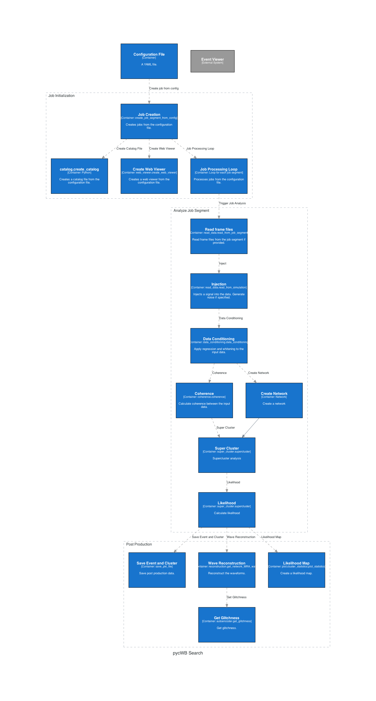

.. pycWB documentation master file, created by
   sphinx-quickstart on Wed Mar  8 13:16:45 2023.
   You can adapt this file completely to your liking, but it should at least
   contain the root `toctree` directive.

Welcome to pycWB's documentation!
===================================

.. image:: https://readthedocs.org/projects/pycwb/badge/?version=latest
   :target: https://pycwb.readthedocs.io/en/latest/
   :alt: Documentation

.. image:: https://git.ligo.org/yumeng.xu/pycwb/badges/main/pipeline.svg
   :target: https://git.ligo.org/yumeng.xu/pycwb/-/pipelines
   :alt: Build Status

.. image:: https://git.ligo.org/yumeng.xu/pycwb/-/badges/release.svg
   :target: https://git.ligo.org/yumeng.xu/pycwb/-/releases
   :alt: Releases

.. image:: https://badge.fury.io/py/pycWB.svg
   :target: https://badge.fury.io/py/pycWB
   :alt: PyPI version

.. image:: https://img.shields.io/badge/license-GPLv3-blue
   :target: https://git.ligo.org/yumeng.xu/pycwb/-/blob/main/LICENSE
   :alt: License

PycWB is a modularized Python package for coherent gravitational-wave burst
searches based on the core algorithms of cWB.

.. toctree::
   :hidden:
   :maxdepth: 5

   install
   credit
   pycWB <modules>
   genindex

.. toctree::
   :hidden:
   :caption: User Guides
   :maxdepth: 1

   tutorials
   schema
   config_repository
   postproduction_workflow

.. toctree::
   :hidden:
   :caption: Developer Guides
   :maxdepth: 1

   mod_cwb

Getting Started
===============

Installation
------------

PycWB is available on `PyPI <https://pypi.org/project/pycWB/>`_. It requires
Python 3.10 or newer. Some scientific and gravitational-wave dependencies are
easiest to install with conda before installing ``pycwb`` with pip.

.. code-block:: bash

   conda create -n pycwb python=3.13
   conda activate pycwb
   conda install -c conda-forge root=6 healpix_cxx=3 nds2-client python-nds2-client lalsuite python-ligo-lw setuptools_scm cmake pkg-config
   python3 -m pip install pycwb

If ROOT is not available, PycWB builds without the ROOT-backed C++ wavelet
extension and uses the native Python analysis path. See
:ref:`installing_pycwb` for source, pure-Python, and Apple Silicon notes.

Run your first burst search
---------------------------

In your first burst search, we will use a built-in noise generator and waveform generator
to minimize the requirement for external data. What you need is just one configuration file in YAML format.

To start with, copy the example configuration folder from the source code or download
``user_parameters_injection.yaml`` manually from
`examples/injection <https://git.ligo.org/yumeng.xu/pycwb/-/tree/main/examples/injection>`_.

.. code-block:: bash

    cp -r [path_to_source_code]/examples/injection my_first_search
    cd my_first_search

Now you can run the example in the terminal with the ``pycwb run`` command.

.. code-block:: bash

    pycwb run user_parameters_injection.yaml

You can also run the same workflow from Python:

.. code-block:: python

   from pycwb.workflow.run import search

   search("user_parameters_injection.yaml")

Or open the Jupyter notebook ``pycwb_injection.ipynb`` in the example folder and
run the search step by step.

Go deeper into the search workflow
~~~~~~~~~~~~~~~~~~~~~~~~~~~~~~~~~~

If you want to know more about the search process, please refer to
:ref:`tutorial_search`

Step by step injection!
~~~~~~~~~~~~~~~~~~~~~~~~~~~~~

If you want to know more about the injection process step by step, please refer to
:ref:`tutorial_injection` or the Jupyter notebook ``pycwb_injection.ipynb``.

Command line interfaces (CLI)
------------------------------

It is recommended to use the command line interfaces (CLI) to run the search.
You can get help by running the command with the ``-h`` option. Here are the current available commands:

.. list-table:: Available Commands
   :header-rows: 1

   * - Command
     - Description
   * - ``pycwb run``
     - Run a single search
   * - ``pycwb flow``
     - Run a search through the Prefect flow wrapper
   * - ``pycwb batch-setup``
     - Set up an HTCondor or SLURM batch run
   * - ``pycwb config-setup``
     - Create a project from a configuration repository and optionally submit it
   * - ``pycwb clone-dir``
     - Clone an existing directory layout
   * - ``pycwb batch-runner``
     - Run one batch job payload
   * - ``pycwb post-process``
     - Run a post-production workflow
   * - ``pycwb gwosc``
     - Download data and set up a GWOSC event analysis
   * - ``pycwb gwosc-data``
     - Download GWOSC data for an existing user-parameter file
   * - ``pycwb get-external-modules``
     - Fetch configured external modules
   * - ``pycwb online``
     - Run an online gravitational-wave search
   * - ``pycwb progress``
     - Summarize run progress from catalog/progress Parquet files
   * - ``pycwb xtalk``
     - Convert an xtalk file
   * - ``pycwb merge``
     - Merge catalog or wave files
   * - ``pycwb simulation-summary``
     - Build a per-simulation summary Parquet file
   * - ``pycwb match-simulations``
     - Match trigger catalogs to simulation summaries

Basic Workflow
==============

Indices and tables
==================

* :ref:`genindex`
* :ref:`modindex`
* :ref:`search`
