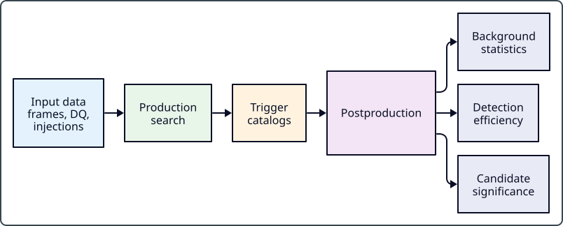

.. _welcome-to-pycwb-s-documentation:

PycWB documentation
===================

PycWB is a modular Python implementation of coherent WaveBurst (cWB/cWB-2G)
for gravitational-wave burst searches.

.. rst-class:: docs-version

   Version |release|. Match it to ``pycwb --version``. Development documentation
   may include unreleased features; check :ref:`release_policy` before installing.

.. _quick-start:

Get started
-----------

.. container:: docs-start

   * :doc:`Install PycWB <install>`

     Choose a version and prepare your environment.

   * :doc:`Run your first search <start_here>`

     Recover a simulated burst and inspect the results.

.. _choose-your-path:
.. _documentation-map:

Explore the documentation
-------------------------

.. container:: docs-paths

   * :doc:`Tutorials <tutorials>`

     Learn with worked examples: injections, custom waveforms, and batch runs.

   * :doc:`Run analyses <run_analyses>`

     Configure searches, run on clusters, and process the results.

   * :doc:`Concepts and methods <core_concepts>`

     Understand the pipeline, coherent reconstruction, and significance.

   * :doc:`Reference <reference>`

     Look up parameters, commands, data formats, conventions, and Python APIs.

Contributing code? See :doc:`development` for setup, architecture, and testing.

.. _what-is-pycwb:
.. _id1:

How the search works
--------------------

Watch the :ref:`60-second search lifecycle animation <search_lifecycle_animation>`
and explore each stage in :doc:`pipeline_lifecycle`.
For the project introduction, see :doc:`about`.

.. _cli-reference:
.. _indices-and-tables:

See :doc:`cli_reference` for commands, or :ref:`reference_indexes` for the
complete indexes and search. For questions, see :doc:`support`; for publication
credits, see :doc:`credit`.

.. toctree::
   :hidden:
   :maxdepth: 6

   getting_started
   tutorials
   run_analyses
   core_concepts
   reference
   development

.. toctree::
   :hidden:
   :caption: Project
   :maxdepth: 6

   about
