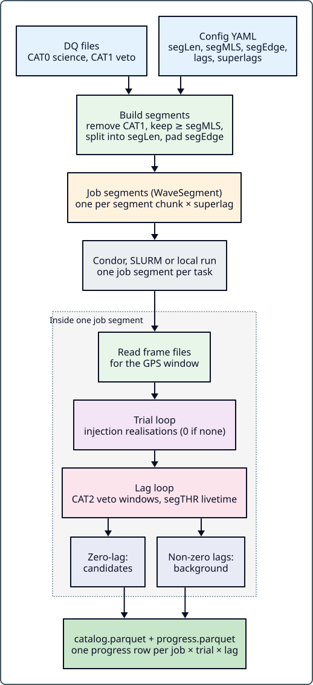

.. _job_control:

Job Control
===========

.. stage-nav:: search
   :current: segments

This guide explains how pycWB defines and manages analysis jobs, including the
lag/slag structure, trial indexing, segment construction from data-quality
files, and parallelization strategies.

.. contents:: Table of Contents
   :depth: 2
   :local:

Why this matters
----------------

Job control determines how your search is split across computing resources.
Understanding segments, lags, and trials is essential for debugging failed
jobs, estimating runtime, and optimizing cluster utilization. If jobs are
failing or your run takes too long, this is the page to read.

Job Decomposition
-----------------

Overview
--------

A pycWB analysis run is decomposed into **job segments**—independent units of
work that can be distributed across cluster nodes. Each job segment is a GPS
time window containing detector data, processed across multiple **lags**
(time-shift hypotheses) and optionally **trials** (injection groups).

The job structure is built by
:py:func:`pycwb.modules.job_segment.job_segment.create_job_segment_from_config`,
which reads the user parameter YAML and produces a list of
:py:class:`~pycwb.types.job.WaveSegment` objects.

Job Segment Construction
------------------------

pycWB supports five modes for defining job segment time windows:

1. **Pure Simulation** (deprecated) — no ``DQF`` entries and no period are
   given. Segments come from ``injection.segment.start`` / ``end`` and the
   ``simulation`` mode (``all_inject_in_one_segment`` or
   ``one_inject_in_one_segment``), with optional synthetic noise from
   ``injection.segment.noise``.

2. ``gps_start`` / ``gps_end`` — an explicit analysis period:

   .. code-block:: yaml

      gps_start: 1264060000
      gps_end: 1264063600

3. ``gps_center`` + ``time_left``/``time_right`` — a centered window:

   .. code-block:: yaml

      gps_center: 1264060000
      time_left: 500
      time_right: 500

4. ``superevent`` + ``time_left``/``time_right`` — queries GraceDB for the
   GPS time of a superevent (e.g., ``S190521g``) and builds a window around it.

   Modes 2–4 only define an analysis *period*. The period goes through the
   same algorithm as mode 5: it is intersected with any ``DQF`` entries,
   trimmed by ``segEdge`` at both ends and split into jobs of at most
   ``segLen`` seconds.

5. **DQ Files** — builds segments from the data-quality lists in ``DQF``.
   This is the standard mode for production searches. Each row is
   ``[ifo, file, category, shift, invert, c4]``. Every file is read as a list
   of ``start stop`` intervals (``c4: True`` for 4-column files), shifted by
   ``shift`` seconds. ``invert: True`` uses the complement, which turns a veto
   list into a keep list:

   .. code-block:: yaml

      DQF: [
        [ "H1", "input/H1_cat0.txt", CWB_CAT0, 0., False, False ],  # science segments
        [ "L1", "input/L1_cat0.txt", CWB_CAT0, 0., False, False ],
        [ "H1", "input/H1_cat1.txt", CWB_CAT1, 0., True,  False ],  # CAT1 veto list
        [ "L1", "input/L1_cat1.txt", CWB_CAT1, 0., True,  False ],
        [ "H1", "input/H1_cat2.txt", CWB_CAT2, 0., True,  False ],  # CAT2 veto list
        [ "L1", "input/L1_cat2.txt", CWB_CAT2, 0., True,  False ],
      ]

   The segment-building algorithm
   (:py:func:`~pycwb.modules.job_segment.job_segment.job_segment_from_dq`):

   a. For each detector, intersect all ``CWB_CAT0`` and ``CWB_CAT1`` entries,
      plus the period from modes 2–4 if one is given, into one good-time list.
   b. Intersect the per-detector lists across detectors to get coincident
      segments. With super lags, each detector's list is first shifted by
      ``slag[k] × segLen`` (see `Super Lags (Segments)`_).
   c. Trim ``segEdge`` seconds from both ends of every coincident segment. The
      trimmed margin becomes the wavelet boundary padding, so padded data stays
      inside good time.
   d. Discard trimmed segments shorter than ``segMLS``. Split the rest into
      jobs of at most ``segLen`` seconds: full ``segLen`` chunks, with the
      final remainder split into two halves if each half is at least
      ``segMLS``. Otherwise the remainder becomes one ``segLen`` job and the
      leftover time is not analysed.
   e. Shorten a job by 1 s if its length breaks WDM pixel parity, then extend
      the end of every job by ``segOverlap`` seconds.
   f. If any ``CWB_CAT2`` entry exists, intersect the CAT0, CAT1 and CAT2
      entries per detector and across detectors into CAT2 *keep windows*. These
      are clipped to each job and stored on the segment (``veto_windows``,
      plus a superlag-shifted copy in ``cwb_veto_windows``). CAT2 never splits
      or drops jobs. It masks time-frequency pixels during coherence and sets
      the post-CAT2 livetime that ``segTHR`` is checked against.

Segment Sizing Parameters
-------------------------

.. list-table::
   :header-rows: 1
   :widths: 22 15 63

   * - Parameter
     - Default
     - Description
   * - ``segLen``
     - 600 s
     - Nominal (maximum) job length
   * - ``segMLS``
     - 300 s
     - Minimum job length after CAT1 and ``segEdge`` trimming
   * - ``segTHR``
     - 30 s
     - Minimum post-CAT2 livetime per lag; lags below it are skipped
       (0 disables)
   * - ``segEdge``
     - 8 s
     - Wavelet boundary padding on each side, trimmed from good time
   * - ``segOverlap``
     - 0 s
     - Seconds added to the end of each job (overlap with the next job)

``segTHR`` is applied at run time, per lag. When a job has CAT2 keep windows,
the post-CAT2 livetime is computed with that lag's (circular) shifts. If the
result is below ``segTHR``, the lag is skipped and recorded with status
``skipped_segTHR``.

Lag Structure
-------------

Lags implement the time-shift analysis used to estimate the background
(accidental coincidence rate). For an :math:`N`-detector network, time-shifting
detectors' data relative to each other breaks any real gravitational-wave
coincidence. The animation in :ref:`lags_and_superlags` shows how lags and
superlags shift the data.

Regular Lags
~~~~~~~~~~~~

.. code-block:: yaml

   lagSize: 100       # Number of lags to generate
   lagStep: 1.0       # Time step between lags [s]
   lagOff: 0          # First lag id / row (0 = include zero-lag)
   lagMax: 0          # 0 = standard lags; >0 = extended lags (max lag id, in lagStep units)

Lags are computed per job by ``WaveSegment.lag_shifts``. Each lag is a vector
of integer lag ids, one per detector, and detector :math:`k` is shifted by
:math:`\text{id}_k \times \text{lagStep}` seconds.

**Standard lags** (``lagMax: 0``). Only the first detector in ``ifo`` is
shifted:

.. math::

   \text{shift}_m = (m \times \text{lagStep},\ 0,\ \dots,\ 0),
   \quad m = \text{lagOff}, \dots, \text{lagOff} + \text{lagSize} - 1

**Extended lags** (``lagMax > 0``). Lag-id vectors are drawn at random with a
fixed seed (13). The first detector is fixed at 0 and every other detector gets
a uniform integer id in :math:`[-\text{lagMax}, \text{lagMax}]`. A vector is
rejected if two detectors share an id or if it repeats an earlier vector.
Each accepted vector is then shifted so its minimum id is 0. Row 0 is always
the zero lag, and rows ``lagOff`` … ``lagOff + lagSize − 1`` are used.

**Segment-duration cap** (both modes). A lag is dropped if any of its ids
exceeds :math:`\lfloor T / \text{lagStep} \rfloor - 1`, where :math:`T` is the
job's analysis duration. The number of lags per job (``n_lag``) can therefore
be smaller than ``lagSize`` and depends on the job length.

- **Zero-lag** (all shifts zero, included when ``lagOff: 0``) represents
  the physical (unshifted) coincidence—where a real GW signal would appear.
- **Non-zero lags** are used for background estimation.

.. note::

   The schema defaults are ``lagSize: 1``, ``lagOff: 0`` and ``lagMax: 0``,
   so a configuration without lag settings analyzes only the zero lag.
   v1.1.0a3 and earlier defaulted to ``lagOff: 6`` and ``lagMax: 150``, which
   selected one extended lag instead; see :ref:`migration` before resuming
   runs prepared with those defaults.

In extended mode, ``lagSite`` gives one site index per detector (for example
``lagSite: [0, 0, 1]``). Ids are then drawn per site: detectors with the same
site index get the same shift, and only detectors at different sites must have
different ids.

You can also provide the lag shifts explicitly in a lag file:

.. code-block:: yaml

   lagSize: 0                    # required when lagFile is set
   lagFile: input/lags.txt       # one row per lag, one column per detector [s]

``lagFile`` is a whitespace-separated table of shifts in seconds, with one
column per detector in ``ifo`` order. When it is set, ``lagSize`` must be 0 or
job setup raises an error. The native pipeline always reads ``lagFile`` when it
is set. ``lagMode`` (``w``/``r``) only affects the ROOT (cWB network) backend.
An explicit lag array can also be given for one run on the command line, e.g.
``pycwb run ... --lags "0,0;0,600"``. This cannot be combined with ``lagFile``.

Super Lags (Segments)
~~~~~~~~~~~~~~~~~~~~~

Super lags (slags) provide an additional layer of time shifts at the segment
level, used for multi-detector networks:

.. code-block:: yaml

   slagSize: 10       # Number of super lags (0 = standard segments, no super lags)
   slagMin: 0         # Minimum super-lag distance (integer)
   slagMax: 5         # Maximum super-lag distance; also bounds each shift (integer)
   slagOff: 0         # Number of super lags skipped (0 = include the zero super lag)

Super lags are generated by
:py:func:`~pycwb.modules.superlag.superlag.generate_slags`. Each super lag is
an integer vector :math:`(0, s_1, \dots, s_{N-1})` with one entry per detector,
and the first detector is fixed at 0. The other entries are non-zero, pairwise
distinct and satisfy :math:`|s_k| \leq \text{slagMax}`. The all-zero vector is
also a candidate. The distance of a vector is :math:`\sum_k |s_k|`.
Candidates with ``slagMin`` ≤ distance ≤ ``slagMax`` are sorted by distance.
The first ``slagOff`` are skipped, the next ``slagSize`` are kept, and the kept
list is shuffled with a fixed seed (0). The zero super lag is included only
when ``slagMin`` and ``slagOff`` are both 0.

Shifts are in units of ``segLen``. Detector :math:`k`'s CAT1 segment list is
shifted by :math:`s_k \times \text{segLen}` seconds before the cross-detector
intersection, and jobs are built separately for each super lag (the shift is
stored in ``WaveSegment.shift``). The number of jobs per super lag depends on
how much shifted coincident time exists. Setup fails if a super lag has none.
The total job count is the sum over the selected super lags (at most
``slagSize``).

Trial Indexing
--------------

For simulation (injection) studies, each job segment can contain multiple
**trials**—groups of injections that share the same noise background.
A job is one ``WaveSegment``. Trials and lags are loops *inside* a job: the job
processes every trial present in its injections, and every lag for each
trial. By default:

.. math::

   \text{total\_jobs} = \sum_{\text{slags}} N_{segments}(\text{slag})

(with no super lags this is just the number of segments).

- ``trial_idx``: identifies which trial an injection belongs to within a
  job segment.
- ``sim_idx``: unique identifier for each injection across all trials and
  jobs.
- ``job_id``: the ``WaveSegment.index``, numbered from 1 across all super
  lags. It does not encode the trial unless jobs are flattened (below).

When ``parallel_injection_trail`` is enabled, job segments are flattened by
trial via
:py:func:`~pycwb.modules.job_segment.job_segment.flatten_job_segments_by_trial`,
so each (job, trial) pair present in the injections becomes a separate job.
Jobs are renumbered with contiguous ``job_id`` values, and each injection keeps
the original id in ``source_job_id``. This enables trivial parallelization
across trials.

Job Directory Structure
-----------------------

A run creates this layout once in its working directory (not once per job):

.. code-block:: text

   <workdir>/
   ├── output/           # Waveform output files
   ├── log/              # Job log files
   ├── config/           # Copy of user_parameters.yaml
   ├── catalog/          # Parquet trigger catalogs
   │   ├── catalog.parquet
   │   ├── progress.parquet
   │   └── fragment/     # Batch catalog_<id>.parquet / progress_<id>.parquet
   ├── trigger/          # Per-trigger folders with JSON files
   ├── job_status/       # Created at setup; the pipeline writes nothing here
   ├── public/           # Public-facing results
   └── input/            # DQ files, frame lists, etc.

Batch workers write to fragment catalogs under ``catalog/fragment/``.
``pycwb merge`` combines them into ``catalog.parquet`` and
``progress.parquet``.

Frame File Selection
--------------------

Frame files (containing detector strain data) are selected in two ways:

1. **Frame-list files** via the ``frFiles`` parameter:

   .. code-block:: yaml

      frFiles: ["input/H1_frames.in", "input/L1_frames.in"]

   There is one frame-list text file per detector, in the same order as
   ``ifo``. Each line is the path to a ``.gwf`` file. The GPS start and
   duration are parsed from the file name (``...-<gps>-<duration>.gwf``).

2. **gwdatafind query** via the ``gwdatafind`` config block:

   .. code-block:: yaml

      gwdatafind:
        site: [H, L]
        frametype: [H1_HOFT_C00, L1_HOFT_C00]
        host: datafind.igwn.org

   ``site`` and ``frametype`` are lists with one entry per detector, in
   ``ifo`` order. ``site`` defaults to the first letter of each detector name.
   ``urltype`` (default ``file``) sets the URL type. pycWB runs one query per
   detector over the full GPS span of all jobs (± ``segEdge``). It then attaches
   to each job the frames that overlap its padded window. If both ``frFiles``
   and ``gwdatafind`` are set, ``frFiles`` is used.

Parallelization
---------------

Jobs are parallelized at two levels:

- **Across lags** — within one job, background lags can run concurrently in
  threads (controlled by ``parallel_lag_workers``, default 1). This applies
  only when the job has no injections and more than one lag. Otherwise lags
  run sequentially.
- **Across segments** — different job segments are independent and can run on
  different cluster nodes (see :ref:`run_on_clusters`).

For SLURM/HTCondor batch submission, jobs are bundled into workers via
``job_per_worker`` to balance scheduling overhead against parallelism.

Progress Tracking
-----------------

Each completed or skipped lag adds one row to the progress file next to the
catalog. Local runs use ``catalog/progress.parquet``. Batch workers use
``catalog/fragment/progress_<id>.parquet``, which ``pycwb merge`` combines.
Each row stores ``job_id``, ``trial_idx``, ``lag_idx``, ``n_triggers``,
``livetime`` (post-veto seconds), ``timestamp`` (write time) and ``status``
(``completed`` or ``skipped_segTHR``). A lag that fails writes no row. When a
batch worker restarts, lags already recorded are skipped, so an interrupted job
resumes at the missing lags. The ``pycwb progress`` CLI command summarizes this
information:

.. code-block:: bash

   pycwb progress --work-dir /path/to/run

----

**See also:** :doc:`pipeline_lifecycle` · :doc:`run_on_clusters` · :doc:`injection_infrastructure`

**Next:** :doc:`data_ingestion` — how each job reads its strain
