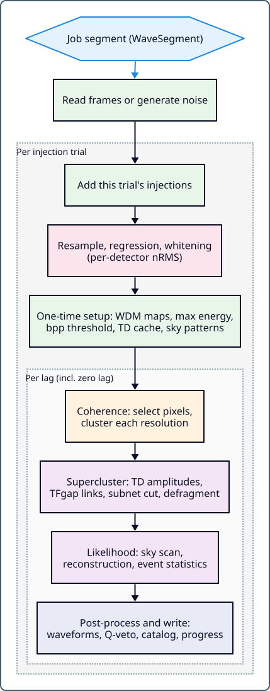

.. _pipeline_lifecycle:

Pipeline Lifecycle
==================

This page walks through the complete pycWB analysis pipeline—from raw detector
data to final detection efficiency. Think of it as a map: each step links to
the detailed guide where you can learn more.

The stages below are pycWB's modular Python implementation of the same
cWB/cWB-2G search algorithms: WDM time-frequency analysis, coherent pixel
selection, clustering and superclustering, likelihood evaluation, waveform
reconstruction, and postproduction ranking.

.. _search_lifecycle_animation:

Search lifecycle animation
--------------------------

Watch a simulated H1–L1 signal move through detector projection, whitening,
multi-resolution WDM analysis, pixel selection, clustering, superclustering,
sky reconstruction, waveform recovery, and time-slide background estimation
in 60 seconds.

.. raw:: html

   <video controls playsinline preload="none" width="1280" height="720"
          style="width: 100%; height: auto;"
          poster="_static/media/pycwb_search_animation_poster.png"
          aria-label="PycWB search lifecycle: nine stages from detector projection to time-slide background estimation">
     <source src="_static/media/pycwb_search_animation.mp4" type="video/mp4">
     
<a href="_static/media/pycwb_search_animation.mp4">Download the search lifecycle animation.</a>

   </video>

`Download the video (MP4) <_static/media/pycwb_search_animation.mp4>`_
or `view the GIF <_static/img/pycwb_search_animation.gif>`_.

The panels are computed from simulated data using the educational model in
``examples/search_animation/``. The model simplifies the production likelihood,
subnet cuts, and multi-resolution reconstruction; it does not illustrate
postproduction training or detection-efficiency studies. See the
:download:`animation notes <../../examples/search_animation/README.md>`
for the scene descriptions, approximations, and rendering instructions.

.. contents:: Table of Contents
   :depth: 2

Overview
--------

cWB-2G Stage Correspondence
---------------------------

The ROOT/C++ cWB-2G notes describe the production algorithm as a sequence of
named stages: data conditioning, WDM setup, coherence, supercluster, and
likelihood. pycWB keeps that same algorithmic decomposition, but stores the
intermediate objects in Python data structures, Parquet catalogs, and trigger
files instead of ROOT job-file cycles.

.. list-table::
   :header-rows: 1
   :widths: 22 42 36

   * - cWB-2G stage
     - Algorithmic role
     - pycWB implementation
   * - Data conditioning
     - Read detector strain, add configured injections, resample, remove lines,
       estimate detector noise RMS, and whiten the data.
     - :py:mod:`pycwb.modules.read_data`,
       :py:mod:`pycwb.modules.injection`,
       :py:mod:`pycwb.modules.data_conditioning`
   * - WDM and MRA setup
     - Initialize WDM transforms for each resolution level and load the
       cross-resolution MRA/XTalk catalog used by reconstruction.
     - :py:mod:`pycwb.modules.coherence_native`,
       :py:mod:`pycwb.modules.xtalk`
   * - Coherence
     - Build time-frequency maps, compute each detector's maximum energy over
       the allowed time delays, set the black-pixel threshold, select
       significant pixels per lag, and perform single-resolution clustering.
     - :py:mod:`pycwb.modules.coherence_native`
   * - Supercluster
     - Merge per-resolution clusters, load time-delay amplitudes, link clusters
       within ``TFgap`` into superclusters, apply the sub-network cut, and
       defragment nearby structures (defragmentation runs before the
       sub-network cut when ``pattern ≠ 0``).
     - :py:mod:`pycwb.modules.super_cluster_native`
   * - Likelihood
     - Loop over surviving clusters, scan sky directions, evaluate the coherent
       likelihood, reconstruct the waveform, and write event parameters.
     - :py:mod:`pycwb.modules.likelihoodWP`,
       :py:mod:`pycwb.modules.reconstruction`

1. Segment Construction
-----------------------

The analysis period is divided into contiguous analysis windows called
**job segments**, each padded by ``segEdge`` on both sides (analysis windows
overlap only when ``segOverlap`` is set). Segments are built from the
configuration and data-quality lists alone, before any strain is read. Each
segment is an independent unit of work that can run on a separate cluster node.

- CAT0/CAT1 DQ files define the segments; CAT2 files become veto windows
  inside each segment
- ``segLen``, ``segMLS``, ``segEdge`` control segment boundaries
- Frame files are matched to each segment's GPS window

→ Each segment becomes a **job**. Time-slide lags and injection trials are
looped over inside the job; superlags (and, optionally,
``parallel_injection_trail``) create additional jobs. See :ref:`job_control`.

2. Data Ingestion
-----------------

Each job reads the gravitational-wave strain for its own segment window from
frame files (``.gwf``) listed in ``frFiles`` or discovered with
``gwdatafind``, one time series per detector. The frames must already be
sampled at the input rate ``inRate``; a mismatch is an error. Resampling to the
analysis rate happens later, during conditioning. NDS2 streaming is used only
by the online search (``pycwb online``, :py:mod:`pycwb.modules.online`).

- Config: ``frFiles``, ``gwdatafind``, ``inRate``
- Module: :py:mod:`pycwb.modules.read_data`

→ Configured injections are added to the strain, which is then conditioned.
See :ref:`data_ingestion`.

3. Data Conditioning
--------------------

Within each segment, the data is prepared for wavelet analysis:

1. **Resampling** to the analysis rate ``rateANA`` = (``fResample`` if set,
   otherwise ``inRate``) / 2\ :sup:`levelR`
2. **Regression** (WDM linear-prediction filter) to remove spectral lines
3. **Whitening** to flatten the noise spectrum

In cWB-2G terminology, this stage produces the whitened detector strain
(``HoT``) and detector noise estimate (``nRMS``). pycWB carries the same
algorithmic products forward as conditioned strain series and per-detector
nRMS maps.

- Methods: wavelet whitening (``wavelet``, alias ``python``) or MESA spectral
  estimation (``mesa``)
- Config: ``fResample``, ``levelR``, ``whiteMethod``, ``whiteWindow``, ``mesaOrder``
- Module: :py:mod:`pycwb.modules.data_conditioning`

→ Output: whitened time series ready for time-frequency decomposition.
See :ref:`data_conditioning`.

4. Time-Frequency Transform
----------------------------

The whitened data is transformed into the time-frequency domain using the
**Wilson-Daubechies-Meyer (WDM)** wavelet transform. Multiple resolution
levels are computed (from ``l_low`` to ``l_high``) to capture signals of
different durations.

The WDM transforms define the time-frequency basis. The MRA/XTalk catalog is a
separate sparse table of overlaps between basis functions at different
resolutions. The sub-network cut and the likelihood use it to correct cluster
energies and pixel amplitudes for energy that appears at several resolutions;
waveform reconstruction then uses those corrected amplitudes.

- Config: ``l_low``, ``l_high``
- Module: :py:mod:`pycwb.modules.coherence_native`

→ Output: time-frequency pixels (amplitude vs. time vs. frequency vs. detector).
See :ref:`wdm_transform`.

5. Coherence & Pixel Selection
------------------------------

Each detector's time-frequency map is replaced by its maximum pixel energy over
time delays up to the maximum inter-detector light-travel time
(``max_delay``); no sky directions are scanned at this stage. A pixel-energy
threshold is derived from the black-pixel probability ``bpp``. For each lag,
the maps are time-shifted by that lag's per-detector shifts, and pixels whose
energy summed over detectors exceeds the threshold (and that pass a
neighbouring-pixel support check) are selected.

This corresponds to the cWB-2G ``maxEnergy`` → threshold → significant-pixel
selection path. Selected pixels are clustered at each resolution before the
multi-resolution supercluster step.

- Config: ``bpp``, ``pattern``
- Module: :py:mod:`pycwb.modules.coherence_native`

→ Output: selected pixels above threshold, grouped by resolution.
See :ref:`clustering_algorithm`.

6. Clustering & Superclustering
-------------------------------

Selected pixels are grouped into **clusters** (per resolution level) and then
merged into **superclusters** across resolutions. A sub-network cut removes
clusters unlikely to be astrophysical.

This is the pycWB equivalent of the cWB-2G ``Supercluster`` stage: merge the
per-resolution clusters into one list, load time-delay amplitudes for all of
their pixels, link clusters within ``TFgap`` into superclusters (dropping
those, including unlinked clusters, with fewer than 3 pixels or energy below
``e2or``), apply
``subNetCut``, and defragment surviving clusters within ``Tgap``/``Fgap``. With
the default
``pattern = 0`` defragmentation runs after the sub-network cut; with
``pattern ≠ 0`` it runs before it.

- Config: ``TFgap``, ``Tgap``, ``Fgap``, ``subnet``, ``subcut``
- Module: :py:mod:`pycwb.modules.super_cluster_native`

→ Each supercluster becomes a candidate event. See :ref:`clustering_algorithm`.

7. Likelihood Evaluation
------------------------

For each supercluster, the likelihood pipeline:

1. Keeps at most ``BATCH`` of the loudest pixels (time-delay amplitudes were
   already attached in the supercluster stage)
2. Scans all sky directions using precomputed time delays, projecting the data
   onto the Dominant Polarization Frame (DPF)
3. Selects the best-fit sky position
4. Computes SNR (:math:`\rho`), network correlation (:math:`cc`) and the
   :math:`\chi^2` penalty at that position, and applies the threshold cuts
5. Reconstructs the waveform and computes :math:`h_{rss}`

This corresponds to the cWB-2G ``likelihood2G`` / ``likelihoodWP`` stage:
loop over superclusters, evaluate the coherent network likelihood, and output
reconstructed event parameters.

- Config: ``netRHO``, ``netCC``, ``delta``, ``cfg_gamma``, ``healpix``, ``BATCH``
- Module: :py:mod:`pycwb.modules.likelihoodWP`

→ Each supercluster that passes the likelihood cuts becomes an **event** in the
trigger catalog. See :ref:`likelihood_guide`.

8. Event Output
---------------

Event parameters of the accepted triggers are written to the Parquet trigger
catalog (``catalog/catalog.parquet``). Each trigger also gets a folder under
``trigger/`` holding its cluster JSON (``save_cluster``, on by default) and,
optionally, its sky-map statistics JSON (``save_sky_map``).
Progress metadata is written to ``catalog/progress.parquet``.

- Each event includes: GPS time, frequency, sky position, SNR, :math:`\chi^2`, network correlation
- Chirp mass is estimated only when ``execution_profile.native_chirp`` and
  ``xgb_rho_mode`` are both enabled, ``Search`` is CBC/BBH/IMBHB, ``optim`` is
  false and ``cfg_search`` is a lower-case search code; otherwise the chirp
  columns stay 0 (see :ref:`event_output`)

→ Jobs complete. Postproduction begins. See :ref:`event_output`.

9. Background Estimation
------------------------

Background triggers are collected from all jobs: every trigger that is not at
physical zero lag, i.e. with a non-zero time-slide lag or a non-zero
superlag (segment) shift. The false alarm rate (FAR) is computed as a function
of ranking statistic. The background livetime is the total analyzed time
across all of these shifted analyses.

- :math:`FAR(\rho^*) = N_{bkg}(\rho \ge \rho^*) / T_{bkg}`
- Train/FAR splitting ensures unbiased estimation

→ See :ref:`postproduction_background`.

10. Ranking & Detection Efficiency
----------------------------------

An XGBoost classifier is trained on background + simulation events to produce
a single **ranking statistic**. This statistic is used to:

1. Assign FAR to each event
2. Measure detection efficiency vs. signal amplitude (:math:`h_{rss}`)
3. Compute hrss50/hrss90 sensitivity figures

→ See :ref:`postproduction_xgboost` and :ref:`postproduction_efficiency`.

Where Each Config Parameter Lives
---------------------------------

.. list-table::
   :header-rows: 1
   :widths: 25 35 40

   * - Pipeline Stage
     - Key Parameters
     - Detailed Guide
   * - Data Ingestion
     - ``frFiles``, ``gwdatafind``, ``inRate``
     - :ref:`standard_analysis`
   * - Segments & Jobs
     - ``segLen``, ``lagSize``, ``lagStep``, ``lagOff``
     - :ref:`job_control`
   * - Conditioning
     - ``fResample``, ``levelR``, ``whiteMethod``, ``mesaOrder``
     - :ref:`schema`
   * - TF Transform
     - ``l_low``, ``l_high``
     - :ref:`schema`
   * - Clustering
     - ``TFgap``, ``Tgap``, ``Fgap``, ``subnet``
     - :ref:`clustering_algorithm`
   * - Likelihood
     - ``netRHO``, ``netCC``, ``healpix``, ``delta``, ``BATCH``
     - :ref:`likelihood_guide`
   * - Postproduction
     - Workflow YAML, train fraction, FAR threshold
     - :ref:`postproduction`

----

**See also:** :doc:`job_control` · :doc:`clustering_algorithm` · :doc:`likelihood_guide` · :doc:`postproduction`

**Next:** :doc:`job_control` — how pycWB splits work into segments, lags, and trials
