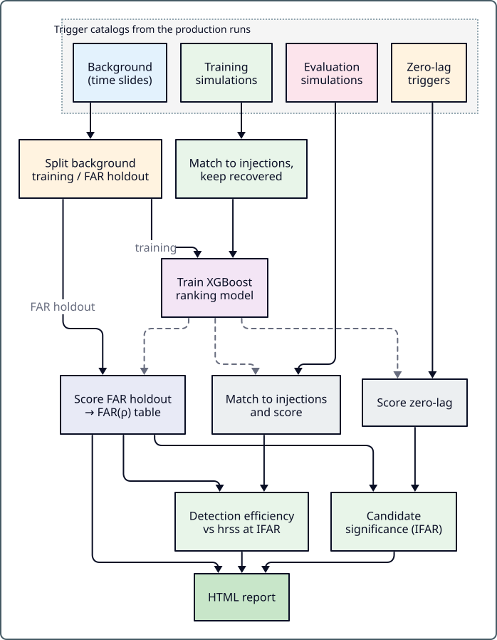

.. _postproduction:

Postproduction
==============

The postproduction pipeline takes the trigger catalogs produced by pycWB
search jobs and produces final analysis products: background estimates, ranked
candidate lists, detection efficiency curves, and HTML summary reports.

Follow the workflow, prepare training inputs, or import cWB ROOT results.
Scientific explanations live under :doc:`core_concepts`; exact action signatures
live in :doc:`postproduction_actions`.

.. toctree::
   :maxdepth: 1

   postproduction_workflow
   postproduction_trainingset
   postproduction_root

Quick Start
-----------

A complete postproduction run is driven by a workflow YAML:

.. code-block:: bash

   pycwb post-process path/to/postprocess_workflow.yaml

To inspect the dependency graph without running:

.. code-block:: bash

   pycwb post-process path/to/postprocess_workflow.yaml --diagram-only

A reference template is available at
``examples/postproduction/standard_analysis_10pct_workflow.yaml``.

Use the :ref:`postproduction_workflow` to learn how to assemble a pipeline,
and the :ref:`postproduction_actions` page to choose an action and look up its
exact Python signature.

Typical Workflow Steps
----------------------

A complete postproduction analysis follows this sequence:

1. **Split background** into training and FAR-holdout subsets
   (:ref:`postproduction_trainingset`).
2. **Match and filter** simulation triggers to injection truth.
3. **Train XGBoost** ranking model on BKG + SIM features
   (:ref:`postproduction_xgboost`).
4. **Score** background holdout with the trained model.
5. **Build FAR** lookup table from scored background
   (:ref:`postproduction_background`).
6. **Score** simulations and compute **detection efficiency**
   (:ref:`postproduction_efficiency`).
7. **Analyze zero-lag** candidates and compute Poisson significance.
8. **Generate HTML report** with all results.

See :ref:`postproduction_workflow` for detailed YAML examples of each step.

Reference and implementation
----------------------------

.. _catalog-job-provenance:

* :doc:`catalog_format`: job manifests, selection provenance, compatibility,
  and transferring complete results.

.. _postproduction-architecture:

* :doc:`dev_postproduction`: workflow engine, action registration, and module roles.
* :doc:`postproduction_actions`: action selection, signatures, and data contracts.
* :doc:`postproduction_background`, :doc:`postproduction_xgboost`, and
  :doc:`postproduction_efficiency`: methods and interpretation.
