.. _postproduction_background:

Background Estimation
=====================

.. stage-nav:: postproduction
   :current: background

This guide explains how pycWB estimates the accidental coincidence background
and constructs a false-alarm-rate (FAR) lookup table.

.. contents:: Table of Contents
   :depth: 2
   :local:

Overview
--------

The background—the rate at which noise fluctuations produce candidate events
with a given ranking statistic—is estimated from **time-shifted (non-zero lag)
data**. By applying time delays between detectors that are larger than the
gravitational-wave travel time, any real signal coincidence is broken, and the
resulting triggers represent the accidental background.

.. _lags_and_superlags:

Lags and Superlags
------------------

         detector inside one job segment) and superlags (pairing of different
         segments between detectors)
   :align: center

   (a) Lags shift the first detector circularly inside a job segment; only
   lag 0 keeps a real signal coincident. (b) Superlags pair different
   segments of the run; unpaired time is not analysed. Not to scale.

Background triggers come from two levels of time shift. Both break the
physical coincidence of a real signal while keeping each detector's noise
unchanged.

- **Lags** act inside a job segment. For standard lag :math:`m`, the first
  detector in ``ifo`` is read at :math:`t + m \times \text{lagStep}` while the
  others stay fixed (extended lags shift several detectors by different
  multiples of ``lagStep``). The shift is circular within the job's analysis
  window, so every lag analyses the whole segment again. A job with
  :math:`n_{lag}` lags turns :math:`T` of data into about
  :math:`n_{lag} \times T` of background livetime. Lags are set by
  ``lagSize``, ``lagStep``, ``lagOff`` and ``lagMax`` (:ref:`job_control`).
- **Superlags** act between segments. For a superlag vector
  :math:`(0, s_1, \dots)`, detector :math:`k` reads GPS time
  :math:`T - s_k \times \text{segLen}`, so segment :math:`j` of the first
  detector is paired with segment :math:`j - s_k` of detector :math:`k`. Each
  superlag builds its own set of job segments from the shifted data-quality
  lists. There is no wrap-around: time without a partner is not analysed.
  Every lag of a superlag job, lag 0 included, is background. Superlags are
  set by ``slagSize``, ``slagMin``, ``slagMax`` and ``slagOff``.
- **Zero lag** is lag 0 of a job without a superlag shift.

Lags can only shift by less than one segment (a lag whose id exceeds
:math:`\lfloor T / \text{lagStep} \rfloor - 1` is dropped). Superlags pair
data that are whole segments apart, which adds independent detector
combinations and multiplies the background livetime further.

Background Estimation Method
----------------------------

pycWB uses the **lag-based** background estimation:

1. **Non-zero lags**: For each job segment, the analysis is repeated at
   multiple time shifts (lags) where one detector's data is shifted relative
   to the others. Jobs may additionally carry a segment (superlag) shift.
   Only lag 0 of an *unshifted* job is the physical zero-lag; every other
   (job, lag) combination—including lag 0 of a superlag-shifted job—produces
   background triggers.

2. **Livetime accounting**: Every analysed (job, lag) pair writes one row to
   ``progress.parquet``. Its ``livetime`` is the post-CAT2 livetime of the
   job segment under that lag's detector shifts, computed with cWB's circular
   lag-buffer semantics
   (:py:meth:`pycwb.types.job.WaveSegment.circular_livetime`). A lag whose
   post-CAT2 livetime is below ``segTHR`` is not analysed; it is recorded with
   status ``skipped_segTHR`` and livetime 0. The background livetime is the sum
   over completed, non-zero-lag progress rows:

   .. math::

      T_{bkg} = \sum_{(j,\ell)\,\in\,\text{completed, non-zero-lag}} T_{live}(j, \ell)

   When the background is split into train/FAR partitions (see below),
   :math:`T_{bkg}` is the livetime of the FAR partition only, available in a
   workflow as ``@<split_step>.far.livetime.seconds``.

3. **FAR computation**: For a given ranking statistic threshold :math:`\rho^*`,
   the false alarm rate is:

   .. math::

      FAR(\rho^*) = \frac{N_{bkg}(\rho \geq \rho^*)}{T_{bkg}}

   where :math:`N_{bkg}(\rho \geq \rho^*)` is the number of non-zero-lag
   background triggers with ranking statistic at or above :math:`\rho^*`
   (ties included). When the FAR table is built from a model-scored catalog,
   triggers failing the configured prediction cuts (``cuts(prediction)``) are
   removed before counting. The binned lookup table is expressed in
   :math:`\text{yr}^{-1}` (:math:`T_{bkg}` converted with
   1 yr = 31 557 600 s); the per-event list is expressed in :math:`\text{s}^{-1}`.

In the reference workflow the FAR table is built by
:py:func:`pycwb.modules.postprocess.evaluate.evaluate_far_rho`, which scores
the FAR partition in memory (only the needed columns are read).
:py:func:`pycwb.modules.postprocess.far.far_rho_plot` builds the same binned
table from an already-scored catalog by streaming Parquet batches; it is used
by :py:func:`pycwb.modules.postprocess.report.standard_background_report`
when no ``far_rho_file`` is supplied.

Zero-Lag Identification
-----------------------

Physical (zero-lag) triggers are identified by
:py:func:`pycwb.modules.postprocess.lag_filters.zero_lag_mask`. A row is
zero-lag only if all of the following hold:

- **Regular lag**: ``lag_idx == 0`` (or ``lag == 0`` when ``lag_idx`` is
  absent), and any ``time_lag*`` columns are zero.
- **Segment (superlag) shift**: the job's ``shift`` in the Catalog job
  metadata is zero for every detector. When no job metadata is available,
  any ``segment_lag*``, ``segment_shift*`` or ``shift*`` columns on the row
  must be zero instead.

All other lag/shift combinations contribute to the background.

Train/FAR Data Splitting
------------------------

To avoid bias, the background data is split into independent **training** and
**FAR** subsets:

- **Training set**: used to train the XGBoost ranking model
  (:ref:`postproduction_xgboost`).
- **FAR set**: held out for unbiased FAR computation.

Splitting strategies (configured via the ``split.by`` field):

- ``interval_livetime`` (or ``interval``): the split unit is a background
  *interval*, i.e. one (superlag shift, ``lag_idx``) combination pooled over
  all jobs with that shift—one complete time-slid realisation of the data.
  Intervals are shuffled with ``seed`` and assigned greedily until each
  partition reaches its fraction of the total livetime; when the fractions sum
  to 1 the last partition takes all remaining intervals. Each realisation
  lies entirely in one partition, but the same physical detector data
  (the same job) appears in both partitions under different time slides.
  Recommended for production; the FAR intervals file also feeds the fake
  open-box report.
- Any other value (default ``livetime``): whole jobs are shuffled and
  assigned greedily by livetime fraction, so all lags of a job land in the
  same partition.

Fractions are livetime fractions, reached approximately (the last unit added
may overshoot the target).

Example split configuration:

.. code-block:: yaml

   - id: bkg_split
     name: Split Background Train/FAR
     action: postprocess.selection.trigger_selection
     inputs:
       catalog_file: ${paths.bkg_catalog}
       progress_file: ${paths.bkg_progress}
     args:
       exclude_zero_lag: true        # Only use non-zero-lag for BKG
       returns: [jobs, triggers, livetime]
       split:
         by: interval_livetime
         seed: 42
         fractions:
           train: 0.1                # ~10% of livetime for training
           far: 0.9                  # remaining livetime for FAR
     outputs:
       train:
         jobs_file: tmp://bkg_train_jobs.txt
         progress_file: tmp://bkg_train_progress.parquet
         intervals_file: tmp://bkg_train_intervals.parquet
         intervals_csv_file: tmp://bkg_train_intervals.csv
         triggers_file: tmp://bkg_train.parquet
       far:
         jobs_file: tmp://bkg_far_jobs.txt
         progress_file: tmp://bkg_far_progress.parquet
         intervals_file: tmp://bkg_far_intervals.parquet
         intervals_csv_file: tmp://bkg_far_intervals.csv
         triggers_file: tmp://bkg_far.parquet

FAR Lookup Table
----------------

The FAR vs. ranking statistic lookup table maps ranking statistic values to
false alarm rates. This table is used to:

1. Assign a FAR to each zero-lag and fake open-box candidate.
2. Draw the FAR vs. ranking statistic plots of the background report.

IFAR thresholds for MDC detections and sensitivity curves are not read from
this table: those actions recount the inclusive background tail directly from
the scored FAR catalog (see :ref:`postproduction_efficiency`).

With ``bin_size`` set, :py:func:`~pycwb.modules.postprocess.evaluate.evaluate_far_rho`
writes a binned table (keys ``bins``, ``far``, ``n_events``, ``cum_events``,
``ranking_par``, ``livetime``, ``livetime_years``):

- bin edges are :math:`e_i = v_{min} + i\,\Delta` up to :math:`v_{max}`
  (``vmin``/``vmax`` default to the minimum/maximum background value);
- ``far[i]`` is the number of background triggers with
  :math:`e_i \le \rho \le e_{last}` divided by :math:`T_{bkg}` in years, and
  is stored at the bin centre ``bins[i]``;
- triggers outside the bin-edge range (``vmin`` to about ``vmax``) are
  **not counted**, so ``vmax`` must lie above the loudest background value.

Without ``bin_size`` it writes a per-event list in which each trigger's FAR is
the inclusive tail count divided by :math:`T_{bkg}` in seconds.

When a FAR is attached to a trigger, the value of the bin whose centre is the
largest one not above :math:`\rho` is used (clipped to the table ends), and
the result is floored at the smallest nonzero tabulated FAR.

.. code-block:: yaml

   - id: far_rho
     name: Score FAR Holdout And Build FAR(ρ)
     action: postprocess.evaluate.evaluate_far_rho
     inputs:
       catalog_file: "@bkg_split.far.triggers_file"
       model_file: ${paths.model_file}
       config_file: ${paths.config_file}
     args:
       livetime: "@bkg_split.far.livetime.seconds"
       ranking_par: rhor
       bin_size: 0.0001
       vmin: 0.0
       vmax: 10.0
     outputs:
       output_file: ${paths.far_rho_file}
       scored_catalog: tmp://bkg_far_scored.parquet

Zero-Lag Significance
---------------------

For each zero-lag candidate, the Poisson probability of at least one
background event with ranking statistic :math:`\geq \rho` during the zero-lag
livetime is:

.. math::

   p = 1 - e^{-\lambda}, \qquad \lambda = FAR(\rho) \times T_{zl}

where :math:`FAR(\rho)` is the attached FAR in :math:`\text{yr}^{-1}` and
:math:`T_{zl}` is the **zero-lag livetime**: the sum of ``livetime`` over
completed zero-lag progress rows (optionally restricted to a job list). The
reported significance is :math:`-\log_{10} p`. The accompanying Poisson plot
compares the cumulative number of zero-lag events vs. IFAR with the expected
background count :math:`T_{zl}/\text{IFAR}` and its 1σ/2σ/3σ Poisson bands.

This is implemented in
:py:func:`pycwb.modules.postprocess.zero_lag.zero_lag_report`.

Blind Analysis (Fake Open Box)
------------------------------

For blind analyses, pycWB supports a "fake open-box" procedure
(:py:func:`pycwb.modules.postprocess.fake_openbox.fake_openbox_report`) that
randomly selects ``fake_openbox_n`` (default 3) background intervals—
(superlag shift, ``lag_idx``) realisations listed in an intervals file, in the
reference workflow the FAR partition's ``intervals_csv_file``—using
``fake_openbox_seed`` (default 150914). Each selected interval is
reported as if it were zero-lag, with p-values computed from that interval's
own livetime, simulating an unblinding without looking at the actual
zero-lag data.

Config & CLI
------------

Key actions for background workflows:

.. list-table::
   :header-rows: 1
   :widths: 35 65

   * - Action
     - Purpose
   * - :py:func:`~pycwb.modules.postprocess.selection.trigger_selection`
     - Split triggers into train/FAR subsets
   * - :py:func:`~pycwb.modules.postprocess.evaluate.evaluate_far_rho`
     - Score background and build FAR lookup
   * - :py:func:`~pycwb.modules.postprocess.far.far_rho_plot`
     - Build the binned FAR table and plots from an already-scored catalog
   * - :py:func:`~pycwb.modules.postprocess.report.standard_background_report`
     - FAR plots, zero-lag and fake open-box reports in one step
   * - :py:func:`~pycwb.modules.postprocess.zero_lag.zero_lag_report`
     - Zero-lag significance analysis
   * - :py:func:`~pycwb.modules.postprocess.lag_filters.zero_lag_mask`
     - Identify physical zero-lag triggers
   * - :py:func:`~pycwb.modules.postprocess.random_filter.random_filter_parquet`
     - Randomly downsample catalogs

.. raw:: html

   

Inspect the background estimate
-------------------------------

After running background estimation, verify:

- **Zero-lag is excluded from FAR background**: the FAR trigger file should
  contain no rows selected by
  :py:func:`~pycwb.modules.postprocess.lag_filters.zero_lag_mask`.
  If zero-lag leaks in, any real signals are counted as background.
- **Livetime matches expected**: the ``livetime.seconds`` returned for the FAR
  partition should equal the sum of ``livetime`` over the completed,
  non-zero-lag rows of the FAR ``progress_file`` output. Lags skipped by
  ``segTHR`` contribute zero.
- **Train/FAR split has no leakage**: verify that no
  (``shift_key``, ``lag_idx``) interval appears in both the training and FAR
  intervals files. With ``interval_livetime`` the same job IDs appear in both
  partitions by design.
- **FAR table covers the background**: the tabulated FAR is non-increasing by
  construction; check that ``cum_events[0]`` equals the number of finite
  ranking values in the scored FAR catalog, i.e. that ``vmin``/``vmax`` span
  all background triggers.

----

**See also:** :doc:`postproduction_xgboost` · :doc:`postproduction_trainingset` · :doc:`likelihood_guide`

**Next:** :doc:`postproduction_trainingset` — splitting triggers for training and FAR
