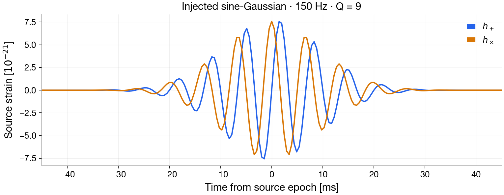
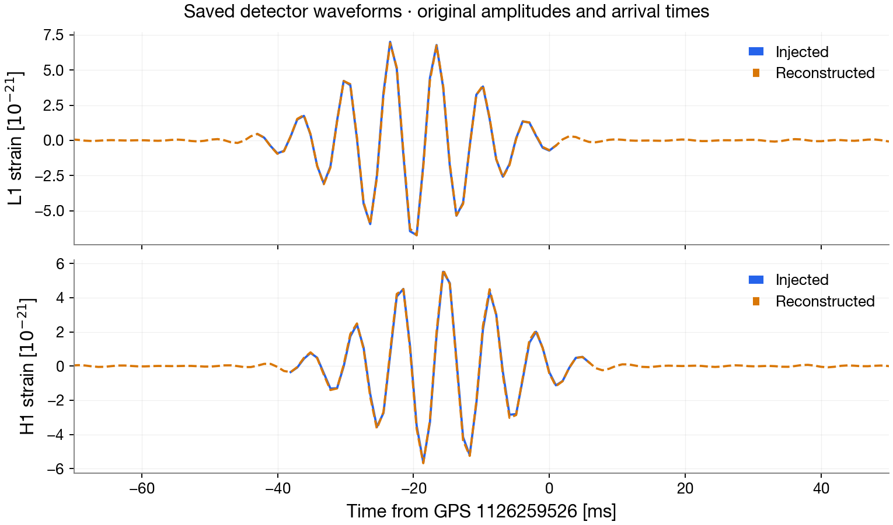

.. _start_here:

Your First Search
=================

Run a complete search for one simulated gravitational-wave burst, then compare
what you injected with what PycWB reconstructed. This example uses a deliberately
loud 150 Hz sine-Gaussian signal in generated Gaussian noise at the LIGO
Livingston (L1) and Hanford (H1) detectors. No detector data, collaboration
account or ROOT installation is needed.

You will read a small configuration, run the ordinary CLI, identify the recovered
event and inspect its waveforms. The figures below come from an executed run of
this example.

.. _check-environment:

Get the example
---------------

First complete :doc:`install`. Download
:download:`user_parameters.yaml <../../examples/demo/user_parameters.yaml>`
into a new tutorial folder and open a terminal there. Alternatively, work from
the root of a source checkout and copy the same file from ``examples/demo/``:

.. code-block:: bash

   cp examples/demo/user_parameters.yaml user_parameters.yaml

The YAML is the complete input to the search. You do not need a Python script
to run the pipeline.

Understand the input
--------------------

The ``injection`` section specifies both the noise segment and the source:

.. literalinclude:: ../../examples/demo/user_parameters.yaml
   :language: yaml
   :start-after: # --- Seeded noise and synthetic burst ---

``approximant: SGE`` selects a sine-Gaussian with two source polarizations,
``frequency`` sets its central frequency, and ``Q`` controls its duration in
cycles. ``hrss`` sets the source amplitude in strain :math:`\sqrt{\mathrm{s}}`;
``iota: 0`` gives the face-on polarization in this example. ``gps_time`` is the
source's geocentric epoch. ``ra``, ``dec`` and ``pol`` are the source sky position
and polarization angle, in radians.

The two noise seeds follow the order of ``ifo: [L1, H1]``. Keeping them fixed lets
you change the signal without also changing the noise realization.

   The source polarizations generated from this YAML. Each detector measures
   a different projection of these two curves, with its own arrival-time delay.

The rest of the YAML configures how PycWB searches the data:

.. list-table:: Key settings in this example
   :header-rows: 1
   :widths: 35 65

   * - Settings
     - What they do here
   * - ``ifo: [L1, H1]``, ``refIFO: L1``
     - Select the two detectors and the reference detector.
   * - ``inRate: 2048``, ``levelR: 1``
     - Generate input at 2048 samples/s and analyze it at 1024 samples/s.
   * - ``fLow: 32``, ``fHigh: 480``
     - Search the 32–480 Hz band, containing the 150 Hz burst.
   * - ``segLen: 128``, ``segEdge: 8``
     - Analyze one 128-second segment with 8 seconds of processing padding on each side.
   * - ``l_low: 4``, ``l_high: 7``
     - Use four wavelet resolution levels to represent the burst in time and frequency.
   * - ``whiteWindow: 60``, ``whiteStride: 20``
     - Set the window and update spacing, in seconds, for estimating the noise used in whitening.
   * - ``lagSize: 1``, ``lagOff: 0``, ``slagSize: 1``
     - Run one unshifted detector combination. This example does not estimate a time-slide background.
   * - ``healpix: 4``
     - Search an all-sky grid with NSIDE 16 (3072 sky pixels).
   * - ``netRHO: 4``, ``netCC: 0.5``
     - Set coherent-ranking and network-correlation cuts for retained candidates.
   * - ``simulation: all_inject_in_one_segment``, ``nfactor: 1``
     - Put the configured source in one synthetic segment and run one injection trial.

Leave the pixel-selection, clustering and regularization settings unchanged for
this first run. Their definitions are in :doc:`schema`; the signal's parameters
describe what is injected, while these search settings control how it is found.

.. _create-and-run-the-example:

Run the search
--------------

.. code-block:: bash

   pycwb run user_parameters.yaml --work-dir my_first_search

Use a fresh work directory for each run.

The first execution may download the approximately 53 MiB wavelet cross-talk
catalog and compile numerical kernels. Allow several minutes and several GiB
of free memory. No real strain data are downloaded. If the catalog is already
available locally, set ``filter_dir`` to its absolute directory and ``wdmXTalk``
to its filename. Relative paths are resolved inside the run's work directory.

Inspect the result
------------------

Check that processing finished
~~~~~~~~~~~~~~~~~~~~~~~~~~~~~~

.. code-block:: bash

   pycwb progress --work-dir my_first_search

Expect one completed job/trial/lag combination. This example produced
**one trigger** and **128 seconds of analyzed livetime**. If no trigger appears,
see :ref:`troubleshooting`.

Find the recovered event
~~~~~~~~~~~~~~~~~~~~~~~~

Run this in Python or a notebook from your tutorial folder:

.. code-block:: python

   import pandas as pd

   events = pd.read_parquet("my_first_search/catalog/catalog.parquet")
   columns = ["time_L1", "time_H1", "central_freq_L1", "rho", "net_cc"]
   print(events[columns].to_string(index=False, float_format="{:.6f}".format))

   # Select candidates near the known injection in both detectors.
   recovered = events.loc[
       (events["time_L1"] - 1126259526).abs().lt(1.0)
       & (events["time_H1"] - 1126259526).abs().lt(1.0)
   ]
   print("Candidates near the injection:", len(recovered))

Each catalog row is a candidate. The example run produced these values:

.. list-table:: Example recovered event
   :header-rows: 1
   :widths: 25 25 50

   * - Field
     - Example value
     - How to read it
   * - ``time_L1``
     - 1126259525.979482 GPS s
     - Reconstructed time at Livingston, close to the source epoch.
   * - ``time_H1``
     - 1126259525.984121 GPS s
     - Reconstructed time at Hanford; detector arrival times need not agree.
   * - ``central_freq_L1``
     - 150.41 Hz
     - Reconstructed frequency, close to the injected 150 Hz.
   * - ``rho``
     - 169.96
     - Coherent ranking statistic, well above this example's cut of 4.
   * - ``net_cc``
     - 0.9977
     - Network correlation statistic, above the configured cut of 0.5.

A high ``rho`` or ``net_cc`` is not a detection probability. This single injected
signal demonstrates recovery; measuring false-alarm rates and sensitivity needs
background and injection populations. See :doc:`understanding_results` for the
full catalog-field guide.

Open the waveform plots
~~~~~~~~~~~~~~~~~~~~~~~

The YAML enables ``save_waveform``, ``save_injection`` and ``plot_waveform``.
Use these products:

.. list-table:: Files to open first
   :header-rows: 1
   :widths: 45 55

   * - Path under ``my_first_search/``
     - What it contains
   * - ``trigger/trigger_*/H1_wf_REC.png`` (and ``L1_wf_REC.png``)
     - Pipeline-generated reconstructed-strain plots for each candidate.
   * - ``trigger/trigger_*/H1_wf_DAT.png`` and ``H1_wf_NUL.png``
     - Data reconstructed from the selected event pixels and the residual ``DAT - REC``. ``DAT`` is not the full raw noise segment.
   * - ``output/wave.h5``
     - Saved detector waveforms, including injected ``INJ`` and reconstructed ``REC`` series, with their epochs and sample rates.
   * - ``catalog/catalog.parquet`` and ``catalog/progress.parquet``
     - Candidate rows and processing-completion records.

Files ending in ``_whiten.png`` show whitened waveforms. Compare waveforms in the
same convention. ``plot_injection`` is off, so injection PNGs are not generated
by default; the injected series are still saved in ``wave.h5``.

To compare the injected and recovered signals on the same axes, download
:download:`plot_results.py <../../examples/demo/plot_results.py>` into your
tutorial folder and run:

.. code-block:: bash

   python plot_results.py my_first_search

This reads the saved configuration and products and writes the two figures on
this page to ``my_first_search/plots/``, together with ``summary.json``.
It selects the loudest candidate within one second of the source in both
detectors. The signal-generation step recreates the source polarizations;
the detector comparison reads the actual saved ``INJ`` and ``REC`` arrays.

   Injected (solid blue) and reconstructed (dashed orange) detector strain from
   this run. Each series uses its stored epoch and sample rate; the curves have
   not been shifted to align their peaks or rescaled to match their amplitudes.

Look for the burst at the same time, with similar oscillations and amplitude
in each detector's pair of curves. The L1 and H1 waveforms can differ in sign,
amplitude and arrival time because of detector geometry. Noise and the selected
time-frequency pixels leave differences between injection and reconstruction.
For direct HDF access and further plots, continue with :doc:`tutorial_event_inspection`.

Download the :download:`example result summary <_static/img/first_search/summary.json>`
for the event values and run details.

Change one setting
------------------

Copy the YAML:

.. code-block:: bash

   cp user_parameters.yaml quieter_parameters.yaml

Change ``injection.parameters.hrss`` from ``1.0e-21`` to ``5.0e-22``. This halves
the source amplitude while leaving the noise seeds, sky position and search
settings fixed. Then run:

.. code-block:: bash

   pycwb run quieter_parameters.yaml --work-dir quieter_search
   pycwb progress --work-dir quieter_search
   python plot_results.py quieter_search

Compare the catalog's ``rho`` and the waveform amplitudes with the first run.
The plotting script preserves amplitudes in strain, so it does not normalize
away the change. In the second run, the quieter source was still recovered,
and ``rho`` decreased from **169.96 to 98.62**. The statistic need not scale
exactly with source amplitude. A sufficiently weak injection may produce no
candidate; the script reports that case instead of selecting an unrelated event.

Continue learning
-----------------

* :doc:`understanding_results`: catalog fields, output layout and empty results.
* :doc:`tutorial_signals`: experiment with sky masks, populations and detector networks.
* :doc:`tutorial_search`: inspect the pipeline's individual Python stages.
* :doc:`support`: get help if the example fails; include the command and traceback.
