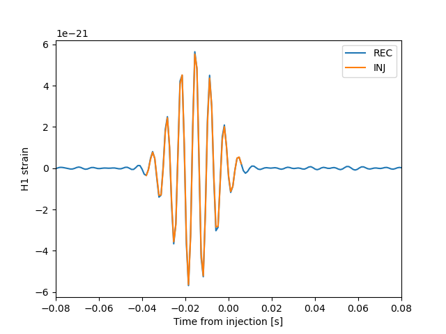

.. _tutorial_event_inspection:

Inspect a Reconstructed Event
=============================

**Question:** What did the search reconstruct in each detector?
Use the completed ``all_sky`` run from :doc:`tutorial_signals` or the real-data
run from :doc:`tutorial_open_data`.

Read the catalog
----------------

.. code-block:: python

   from pathlib import Path
   import pandas as pd

   run = Path("tutorial-work/runs/all_sky")
   events = pd.read_parquet(run / "catalog/catalog.parquet")
   print(events[["id", "job_id", "lag_idx", "time_H1", "time_L1", "rho", "net_cc"]])
   near_signal = events.loc[(events["time_H1"] - 1126259526).abs() < 1.0]
   print(near_signal[["id", "ra", "dec", "rho"]])

The synthetic source is at RA = 1 rad, declination = 0.3 rad. Trigger ``ra``
and ``dec`` are in degrees. Two-detector reconstruction can have sky ambiguity;
a recovered signal need not land on exactly the injected sky pixel.
``rho`` is a ranking statistic, not a probability or a FAR.

Inspect saved waveforms
-----------------------

The exercise enables ``save_waveform`` and ``save_injection``. For the default
HDF output, list the event groups and inspect one without assuming which
candidate is scientifically relevant:

.. code-block:: python

   import h5py
   import matplotlib.pyplot as plt
   import numpy as np

   with h5py.File(run / "output/wave.h5", "r") as handle:
       print("Event groups:", list(handle))
       # Native catalog IDs end in the hash used for the HDF group.
       event_id = str(near_signal.iloc[0]["id"]).rsplit("_", 1)[-1]
       group = handle[event_id]
       print("Saved products:", list(group))
       for label in ["REC", "INJ"]:
           wave = group[f"H1_wf_{label}"]
           start = float(wave.attrs["start_time"])
           rate = float(wave.attrs["sample_rate"])
           time = start + np.arange(len(wave)) / rate
           plt.plot(time - 1126259526, wave[:], label=label)
   plt.xlabel("Time from injection [s]")
   plt.ylabel("H1 strain")
   plt.xlim(-0.08, 0.08)
   plt.legend()
   plt.savefig(run / "H1_reconstruction.png")

   Example output from the seeded all-sky exercise. The curves use each
   dataset's saved epoch and sample rate; values can vary with the code version.

Select a recovered row before running this block; an empty selection needs
investigation rather than an arbitrary event. For real data there is no
``INJ`` product: compare ``REC`` with ``DAT`` instead. Product names ending
in ``_whiten`` contain whitened waveforms; compare like conventions and use
each dataset's stored epoch and sample rate.

The ``NUL`` product describes the reconstruction residual in that output
convention. It can contain noise and unmodeled structure; it is not expected
to vanish for a recovered signal. See :doc:`likelihood_guide` for definitions.

Inspect sky products
--------------------

The prepared YAML enables ``save_sky_map``. Locate the event's files beneath
``trigger/`` and inspect the saved keys before plotting them. To have the
pipeline produce sky plots, set ``plot_sky_map: true`` in a copy of the input
and use a new work directory. Distinguish the reconstructed map from the
input search mask in :doc:`tutorial_sky_masks`; a fine pixel grid alone does
not establish calibrated localization accuracy.

**Result to keep:** an identified catalog row and aligned detector waveform
plots, with the input/output units and the selection used to choose the event.
