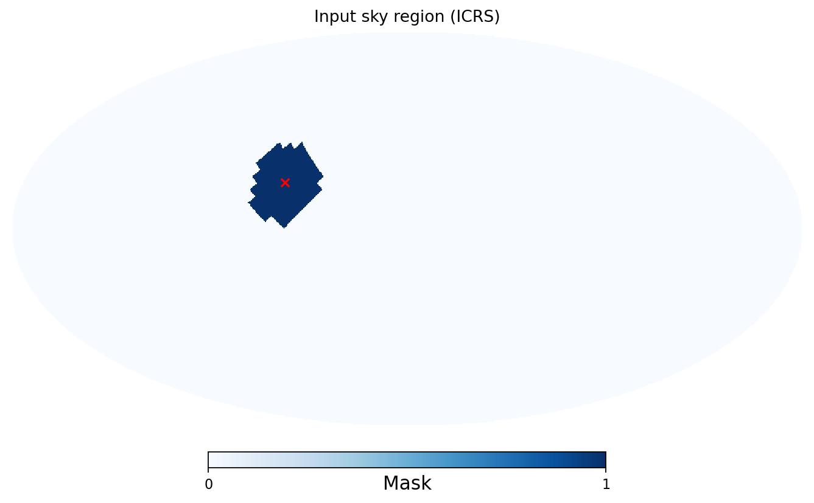

.. _tutorial_sky_masks:

Compare Sky Masks
=================

**Question:** How does restricting the search sky change a reconstruction?
**Prerequisite:** :doc:`tutorial_signals`. All five configurations below share
the same signal and noise; only the likelihood sky mask changes.

Run the comparisons
-------------------

.. code-block:: bash

   pycwb run tutorial-work/fixed.yaml --work-dir tutorial-work/runs/fixed
   pycwb run tutorial-work/patch.yaml --work-dir tutorial-work/runs/patch
   pycwb run tutorial-work/custom.yaml --work-dir tutorial-work/runs/custom
   pycwb run tutorial-work/offset.yaml --work-dir tutorial-work/runs/offset

Keep the ``all_sky`` run as the baseline. The ``fixed`` case selects the grid
direction nearest the source. The ``patch`` case uses:

.. code-block:: yaml

   sky_mask:
     type: Patch
     coordsys: icrs
     patch:
       center:
         ra: "1 rad"
         dec: "0.3 rad"
       radius: "15 deg"

The ``offset`` patch is deliberately displaced. Record whether a candidate
is recovered and how its statistics change; do not assume a displaced patch
must give an empty catalog, especially with a two-detector sky ambiguity.

Inspect the custom region
-------------------------

``region.fits`` is a binary ICRS map with values 0 and 1. It is an input
selection, not a localization probability distribution.

.. code-block:: python

   import healpy as hp
   import matplotlib.pyplot as plt
   import numpy as np

   region = hp.read_map("tutorial-work/region.fits")
   print("Selected input pixels:", (region > 0.5).sum())
   hp.mollview(region, title="Input sky region (ICRS)", unit="Mask")
   hp.projscatter(np.degrees(1.0), np.degrees(0.3), lonlat=True, marker="x", color="red")
   plt.savefig("tutorial-work/input_mask.png")

Here ``lonlat=True`` makes the plotting input longitude/latitude in degrees.

   The generated input mask selects 52 pixels at NSIDE 16. The red cross is
   the injected source; it is not a reconstructed sky position.

The custom config declares ``ordering: ring`` and ``threshold: 0.5``.
The implementation retains map values **strictly greater** than the threshold.
For an external probability map, this value is not a cumulative credible-region
percentage. Prepare the desired region explicitly and check the map's frame,
ordering, resolution and selected pixels. Multi-order maps need conversion to
the supported fixed-resolution representation before using this recipe.

Interpret the results
---------------------

Use :doc:`tutorial_comparisons` to compare catalogs. Record recovery, sky
position, ``rho`` and ``net_cc``. Plot recovered positions over the mask with
the same coordinate convention. ``Fixed`` uses the nearest numerical sky
direction; a very small patch can contain no grid points.

``sky_mask`` restricts the search. ``injection.sky_distribution`` controls
where synthetic sources are placed; changing one does not change the other.
ICRS masks are evaluated at the candidate's GPS time to account for the
celestial-to-Earth-fixed conversion. See :doc:`coordinate_systems` for
``icrs``, ``geo`` and ``cwb`` conventions.

Use a matching masked background before claiming improved significance or
sensitivity. This comparison by itself measures reconstruction behavior.
The complete mask reference is :doc:`targeted_search`.
