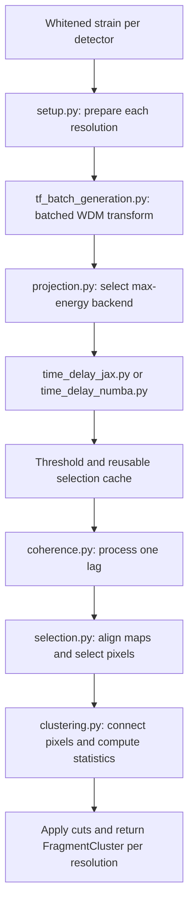

# Native coherence

This package turns whitened detector strain into significant time-frequency
pixels and clusters at each WDM resolution and time lag. It prepares the
expensive transforms once per segment, then reuses them across lags.
Cross-resolution superclustering and likelihood reconstruction happen downstream,
outside this package.

## Entry points and data flow

Use the public imports from `pycwb.modules.coherence_native` or
`pycwb.modules.coherence_native.coherence`:

```python
from pycwb.modules.coherence_native import setup_coherence, coherence_single_lag

# config, strains, job_seg, and nRMS come from job preparation/conditioning.
setups = setup_coherence(config, strains, job_seg=job_seg, nRMS=nRMS)
for lag_idx in range(job_seg.n_lag):
    clusters_by_resolution = coherence_single_lag(setups, lag_idx)
    # Pass this lag's results to downstream processing.
```

`setup_coherence()` returns one setup dictionary per resolution. Each holds the
processed detector maps, threshold `Eo`, selection cache, job segment, execution
profile, and cluster-selection settings. Supply a job segment when calling setup
directly. Lag counts and shifts come from
[`WaveSegment`](../../types/job.py), not from a separate coherence lag planner.

`coherence_single_lag()` returns `list[FragmentCluster]`, indexed by resolution.
The convenience wrapper `coherence(config, strains, job_seg=job_seg, nRMS=nRMS)`
runs setup and all lags, returning `result[resolution][lag]`. If its `job_seg` is
omitted, the wrapper supplies a single zero-lag pass.



## File responsibilities

| File | Responsibility |
| --- | --- |
| [`__init__.py`](__init__.py) | Package-level public exports. |
| [`coherence.py`](coherence.py) | Orchestrates all-lag and single-lag processing; also exposes the established helper imports. |
| [`setup.py`](setup.py) | Builds WDM objects, detector maps, max-energy maps, thresholds, and caches once per resolution. This is runtime setup, not a packaging script. |
| [`tf_batch_generation.py`](tf_batch_generation.py) | Runs detector WDM transforms through JAX batching, including padding and optional time tiling. Setup falls back to serial map construction if batching fails. |
| [`projection.py`](projection.py) | Provides `max_energy()`, applies frequency bounds, and dispatches directly to the JAX or Numba backend. |
| [`time_delay_jax.py`](time_delay_jax.py) | JAX delay loops and packet-energy calculations, including the pattern-zero path. |
| [`time_delay_numba.py`](time_delay_numba.py) | Numba packet-energy calculations and alternative loop layouts; delegates pattern zero to JAX. |
| [`time_delay_common.py`](time_delay_common.py) | Input validation, time-series length and frequency helpers, and Numba packet bounds/neighbor parameters. |
| [`veto_threshold.py`](veto_threshold.py) | Statistical energy thresholds, GPS keep masks, and standalone veto application. |
| [`selection.py`](selection.py) | Builds reusable selection inputs, converts lag shifts to TF bins, and selects network pixels for one lag. |
| [`clustering.py`](clustering.py) | Labels connected pixels, computes subnet/subrho statistics, and constructs `PixelArrays`, `Cluster`, and `FragmentCluster` objects. |
| [`kernels.py`](kernels.py) | Numba kernels for map alignment, pixel support tests, grid connectivity, and cluster statistics. |
| [`run_clustering.py`](run_clustering.py) | Optional connectivity algorithm based on time runs within frequency rows. Produces labels; cluster objects are still built by `clustering.py`. |
| [`module.yaml`](module.yaml) | Module metadata and dependency declarations. |
| [`tests/`](tests/) | Import, selection, clustering, storage, and transform regression tests. |

The orchestration functions live in `coherence.py`; there is no separate
`pipeline.py`. Backend dispatch imports implementations directly, without a
`time_delay_max_energy.py` facade. Packet parameters live in
`time_delay_common.py`, without a separate `time_delay_packet.py`.

## Array and timing conventions

- Raw detector WDM maps have shape `(M + 1, n_time)` and complex128 values encoding
  the two quadratures. Pattern max-energy processing produces real maps and
  applies `TimeFrequencyMap.Gamma2Gauss()`; pattern zero follows a separate path.
- Lag shifts are in seconds. Selection converts them to integer TF-bin offsets
  relative to the minimum detector shift and wraps within the segment interior
  after excluding `segEdge`.
- Candidate detector energies and indices have shape `(n_pixels, n_ifo)`.
  Detector indices use time-major flattening: `time_bin * n_frequency + frequency_bin`.
- Despite the name, `veto_windows` contains GPS intervals to **keep**. The mask
  convention is `1 = keep`, `0 = reject`.
- Supply conditioning's `nRMS` maps for noise-weighted subnet statistics. Omitting
  them retains the unit-weight behavior.
- `return_rejected=True` retains rejected clusters and disables early cuts that
  would otherwise omit their construction.

## Execution choices

`config.max_energy_backend` selects `jax` (default), `numba`, or `auto`. Currently,
`auto` selects Numba for WDM `M` between 32 and 256 inclusive, and JAX otherwise.
This choice concerns max-energy processing; initial batched map generation uses
JAX independently of it.

Other choices come from the immutable
[`ExecutionProfile`](../../config/processing.py), resolved from
`config.execution_profile` and carried in the setup dictionaries.

| Setting | Default | Effect |
| --- | --- | --- |
| `coherence_early_cuts` | `false` | Reject clusters before constructing their objects when rejected output is not requested. |
| `preindex_shifts` | `false` | Use the map-alignment kernel that precomputes shifted time indices. |
| `cluster_runs` | `false` | Use run-based connectivity instead of grid connectivity. A run joins pixels in one frequency row separated by at most `kt` bins, then connects neighboring rows within `kf`. |
| `compact_coherence` | `false` | Release transform references earlier and share prepared real-map storage with the selection cache. Treat those shared maps/cache as read-only after setup. |
| `tiled_wdm` | `false` | Limit transform temporaries by processing time blocks during initial map generation; currently selected only on CPU with supported kernels and time-bin counts divisible by 32. |
| `direct_max_energy_input` | `false` | Experimental: attach conditioned strain directly to batched maps for max energy, avoiding reconstruction from WDM coefficients. This can change numerical results. |
| `bounded_jax_max_energy` | `false` | Use bounded forward transforms inside JAX max-energy loops. |
| `wdm_bounded_numba` | `false` | Use bounded Numba forward transforms in max-energy processing. |
| `numba_max_energy_mode` | `parallel` | Choose `parallel`, `time-major`, or `streaming` traversal when the compiled core is available. |
| `perf_diagnostics` | `false` | Log detailed clustering timings and sizes. |

Additional WDM options are passed through `wdm_options(config)`; the profile
definition is the complete source of settings. The unused
`_time_delay_max_energy_phase_jit` experiment still exists in `time_delay_jax.py`,
but its docstring records disagreement with the reference and production dispatch
does not call it.

## Tests and maintenance

From the repository root, with the project's dependencies installed:

```bash
python -m pytest pycwb/modules/coherence_native/tests -q
```

The tests cover circular lag/CAT2 semantics, import and dispatch contracts,
early-cut equivalence, run/grid connectivity, compact storage, tiled WDM, and
bounded/streaming delay loops. Bounded-transform tests require the corresponding
APIs in the installed `wdm-wavelet` package; an older editable checkout may lack
them even when the rest of the module imports successfully.

The small JAX/Numba parity smoke test is opt-in:

```bash
PYCWB_RUN_MAX_ENERGY_PARITY=1 python -m pytest \
  pycwb/modules/coherence_native/tests/test_refactor_import_contract.py \
  -k jax_numba_max_energy_parity
```

These comparisons protect implementation behavior; they do not replace
end-to-end validation against cWB. Keep changes to numerical kernels separate
from orchestration changes, and retain checks for padding, boundary pixels,
lag wrapping, thresholds, and rejected-cluster behavior when optimizing.
