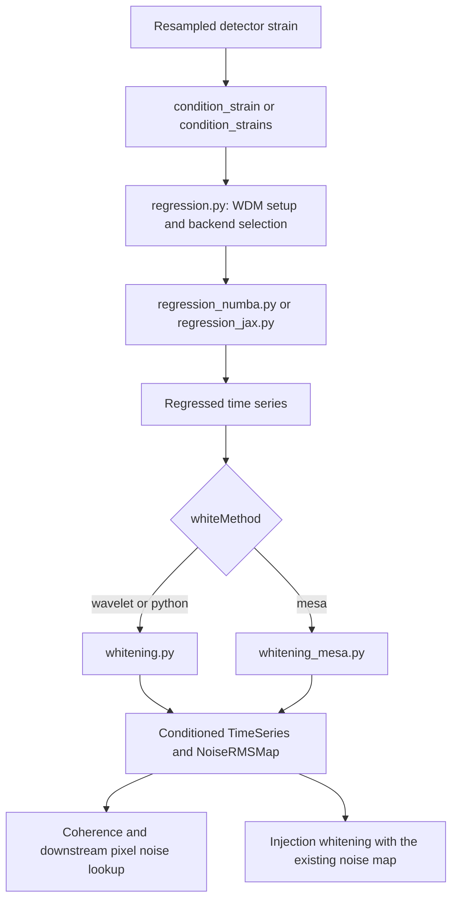

# Native data conditioning

This package regresses and whitens detector strain **once per segment**, before
coherence and time-lag processing. It returns conditioned time series and noise
RMS anchor maps used by downstream pixel statistics and injection reconstruction.
Resampling is performed upstream by the data-reading workflow.

## Public entry points

```python
from pycwb.modules.data_conditioning import condition_strains, condition_strain

# config and resampled detector strains come from job preparation/read_data.
conditioned, noise_maps = condition_strains(config, strains)
# Or process one detector, e.g. inside the caller's thread pool:
conditioned_one, noise_map = condition_strain(config, strains[0])
```

`condition_strains()` returns two tuples in detector order. It completes all
regressions before starting whitening, preserving the established execution
order. `condition_strain()` returns one `(TimeSeries, NoiseRMSMap)` pair.
Detector-level parallelism belongs to the caller; regression can parallelize its
frequency layers internally.

Other public functions are `apply_regression`, `apply_regression_jax`,
`whiten_wavelet`, `whiten_mesa`, `whiten_injection_strain`, and
`apply_psd_correction`. MESA is loaded on demand so importing the package does not
require `memspectrum` or its other optional method-specific dependencies.



## File responsibilities

| File | Responsibility |
| --- | --- |
| [`__init__.py`](__init__.py) | Explicit public exports and on-demand access to `whiten_mesa`. |
| [`data_conditioning.py`](data_conditioning.py) | Single/multiple-detector orchestration and shared whitening-method selection. |
| [`regression.py`](regression.py) | Resolves configuration, prepares WDM layers, dispatches a backend, and reconstructs cleaned strain. |
| [`regression_numba.py`](regression_numba.py) | Numba percentile, correlation, filter-solve, cap, and layer-processing kernels. |
| [`regression_jax.py`](regression_jax.py) | JAX equivalents, JIT specialization, and batching over frequency layers. |
| [`whitening.py`](whitening.py) | Wavelet noise estimation, anchor interpolation, coefficient whitening, and two-quadrature reconstruction. |
| [`whitening_mesa.py`](whitening_mesa.py) | MESA PSD estimation, optional smoothing/reindexing, FFT whitening, and ratio-based noise anchors. |
| [`whitening_common.py`](whitening_common.py) | Shared cWB frequency-bin masking and constant filling for noise maps. |
| [`noise.py`](noise.py) | Noise-anchor construction and lagged pixel RMS lookup. |
| [`injection_whitening.py`](injection_whitening.py) | Whitens signal-only injections using a supplied noise estimate. |
| [`psd_correction.py`](psd_correction.py) | Optional PSD-variability correction; not automatically called by the conditioning entry points. |
| [`module.yaml`](module.yaml) | Module metadata and dependencies. |
| [`tests/`](tests/) | API/dispatch, regression-oracle, backend-parity, and frequency-boundary tests. |

Shared noise-map construction and pixel lookup live in [`noise.py`](noise.py),
with [noise-map tests](tests/test_noise_rms.py).
[`types/noise_rms.py`](../../types/noise_rms.py) contains only the anchor data class.

The separate [`data_conditioning_root`](../data_conditioning_root/) package serves
the ROOT-backed workflow. Its APIs and compatibility imports are independent.

## Configuration and numerical contracts

- `config.whiteMethod` selects `wavelet` (default), `python` (the same wavelet
  path), or `mesa`. The dispatchers do not implement `mixed`.
- [`ExecutionProfile`](../../constants/execution_profile.py) selects
  `regression_engine='numba'` (default) or `'jax'`. The dispatcher imports the
  selected backend when needed; if Numba cannot import, the existing JAX fallback
  is retained. Other PycWB/WDM components may load JAX independently.
- `apply_regression_jax(config, strain)` copies the config and execution profile
  to select JAX without changing the caller's settings.
- Regression honors `regression_cap` and `regression_percentile_stride`. The
  explicit `--regression OLD` search option retains uncapped witness behavior.
  A nonpositive `REGRESSION_FILTER_LENGTH` bypasses regression.
- `whiteWindow`, `whiteStride`, and `segEdge` are in seconds. Wavelet whitening
  uses the cWB-selected power order statistic and normalization factor `0.7191`.
  MESA derives noise anchors from raw/whitened amplitude ratios instead.
- WDM coefficients are complex arrays shaped `(n_frequency, n_time)`; real and
  imaginary components encode the two quadratures. Wavelet whitening averages
  the two inverse quadrature reconstructions. Preserve bin rounding, edge
  selection, floors, and interpolation order when changing these calculations.
- [`NoiseRMSMap`](../../types/noise_rms.py) stores anchor values with shape
  `(n_frequency, n_anchors)`. Its inherited `dt`/`t0` describe the WDM transform;
  `noise_start`/`noise_rate` describe the sparse anchor lattice, and
  `segment_start` is the origin for detector pixel indices. They are not
  interchangeable time coordinates.
- `lookup_pixel_noise_rms` returns `(n_pixels, n_detectors)` float64 values using
  each detector's lagged pixel index and inverse-variance frequency averaging.
- Optional noise variation is an ordinary PycWB `TimeFrequencyMap` with one row
  of float32 correction factors. `dt`/`start` describe its time lattice and
  `f_low`/`f_high` its affected band. It has no wavelet or inverse transform.
  This corresponds to cWB's `WSeries<float> nVAR`; its construction belongs to
  the O3a conditioning plugin. Its validation and pixel RMS application live in
  [`conditioning_plugins/noise_variation.py`](../conditioning_plugins/noise_variation.py);
  `noise.py` delegates there only when a variation map is attached.
- Injection whitening must consume the previously estimated noise map. It does
  not re-estimate noise from the injected signal and retains its own band,
  interpolation, and inverse-phase conventions.

MESA requires `memspectrum`, SciPy, and scikit-learn. Its existing optional
`mesaReindex` path uses an unseeded `IsolationForest`; exact repeated-output
reproducibility for that path is a known limitation, not changed by this cleanup.
The wavelet and MESA estimators remain separate even though their constant-fill
bandpass operation is shared.

## Migration guide

This is an intentional native Python API cleanup. Old function aliases and the
native `whitening_mdc.py` shim are removed. Update both imports and calls; the
module filename `data_conditioning.py` remains unchanged. ROOT APIs are unchanged.

| Previous import/name | Current import/name |
| --- | --- |
| Package or `data_conditioning.data_conditioning` | Package or `data_conditioning.condition_strains` |
| `data_conditioning.data_conditioning_single` | `data_conditioning.condition_strain` |
| `regression.regression_python` | `regression.apply_regression` |
| `regression_jax.regression_jax` | `regression.apply_regression_jax` |
| `whitening.whitening_python` | `whitening.whiten_wavelet` |
| `whitening_mesa.whitening_mesa_python` | `whitening_mesa.whiten_mesa` |
| Package `whitening_mesa_python` or its orchestration wrapper | Package `whiten_mesa` (loaded on demand) |
| Package/module `whitening_mdc` | `injection_whitening.whiten_injection_strain` or the package export |
| `PSD_correction.psd_correction_python` | `psd_correction.apply_psd_correction` |
| `regression._jax_*`, `regression._cap_witness_jax` | Same private names in `regression_jax` |
| `regression._numba_*`, `regression._cap_witness_numba` | Same private names in `regression_numba` |
| `whitening._apply_cwb_bandpass_constant` or MESA's duplicated implementation | `whitening_common._apply_cwb_bandpass_constant` (internal owner) |

Paths in the table are relative to `pycwb.modules.data_conditioning`.
`condition_strains(config, strains)` no longer accepts the unused `nproc`
argument. To parallelize detectors, schedule `condition_strain` externally, as
the online workflow does. Native outputs remain time-domain strains and noise
maps, not ROOT WSeries objects.

The historical `data_conditioning_python` module path is absent; use
`pycwb.modules.data_conditioning` or its `data_conditioning` submodule. Package
`__all__` now explicitly includes the conditioning and regression entry points,
without exposing imported libraries or private whitening helpers.

The following unused helpers and their orchestration re-exports were removed:
`_estimate_noise_rms`, `_estimate_noise_rms_cwb`, `_bandpass_rms`,
`_bandpass_rms_frequency`, `_whiten_coefficients`, `_apply_wiener_filter`, and
`_average_phases`. They have no direct supported replacements: use
`whiten_wavelet` for the production whitening operation. In particular, do not
replace the removed `_average_phases` helper with a split of the time axis;
production quadratures are represented by complex coefficients and separate
inverse transforms.

Before:

```python
from pycwb.modules.data_conditioning import data_conditioning
from pycwb.modules.data_conditioning.regression_jax import regression_jax
conditioned, noise_maps = data_conditioning(config, strains, nproc=1)
cleaned = regression_jax(config, strain)
```

After:

```python
from pycwb.modules.data_conditioning import condition_strains, apply_regression_jax
conditioned, noise_maps = condition_strains(config, strains)
cleaned = apply_regression_jax(config, strain)
```

The forced-JAX wrapper's input keyword is now `strain=` instead of `h=`.
Private backend helpers are test/profiling interfaces; application code should
normally call the public dispatcher.

## Tests and maintenance

From the repository root:

```bash
python -m pytest pycwb/modules/data_conditioning/tests -q
python -m pytest pycwb/config/tests/test_execution_profile.py -q \
  -k 'regression or explicit_jax'
python -m pytest \
  pycwb/modules/job_segment/tests/test_native_low_cost_parallelization.py -q
```

The [regression reference fixtures](tests/reference/README.md) record cWB 6.4.6.9
filter predictions. Preserve these independent fixtures when reorganizing code.
Backend parity tests cover amplitude caps and percentile stride; noise-map tests
cover anchor timing, detector lags, and mixed-resolution pixel support.

These tests do not establish complete pipeline equivalence. Full transform-based
checks require a `wdm-wavelet` version supporting the options emitted by
`wdm_options(config)`; older editable installations can fail before conditioning
runs. Full MESA tests additionally require its optional dependencies. Add
scientific characterization tests before changing estimators, interpolation,
short-segment behavior, or MESA outlier selection.
