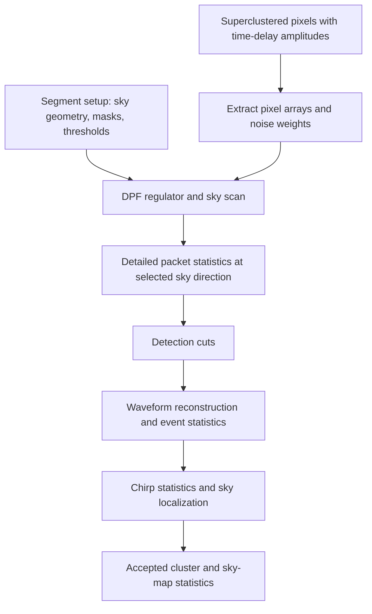

# Native likelihood (CPU)

This package evaluates coherent likelihood for clusters produced by native
superclustering. It scans sky directions, evaluates detailed statistics at the
selected direction, applies detection cuts, and populates reconstructed event,
chirp, and sky-localization results. Numerical inner loops use Numba on CPU.
The separate [`likelihoodWPGPU`](../likelihoodWPGPU/) package reuses some of these
helpers and result types.

## Entry points and data flow

Import the public entry points from `pycwb.modules.likelihoodWP`:

| Entry point | Purpose |
| --- | --- |
| `prepare_likelihood_inputs()` | Prepare segment-level sky geometry, masks, thresholds, and regulators. |
| `evaluate_cluster_likelihood()` | Evaluate one cluster using prepared inputs. |
| `evaluate_fragment_clusters()` | Prepare inputs once and evaluate surviving clusters across lags. |

```python
from pycwb.modules.likelihoodWP import (
    prepare_likelihood_inputs,
    evaluate_cluster_likelihood,
)

# config, strains, and nRMS come from job preparation/conditioning.
# clusters already have time-delay amplitudes from native superclustering;
# xtalk is a loaded cross-talk catalog, reusable across clusters.
setup = prepare_likelihood_inputs(config, strains, config.nIFO)
for cluster in clusters:
    accepted_cluster, sky_map = evaluate_cluster_likelihood(
        config.nIFO,
        cluster,
        config,
        setup=setup,
        xtalk=xtalk,
        nRMS=nRMS,
        chirp_seed=1,
    )
    if accepted_cluster is not None:
        # Consume the accepted cluster and its sky-map statistics.
        pass
```

The single-cluster function mutates the supplied cluster when populating results
and returns `(None, None)` on rejection. Accepted clusters have
`cluster_status == -1`. For standalone calls without prepared inputs, supply
`strains` (or `supercluster_setup`) and `MRAcatalog` so setup and cross-talk data
can be constructed.

The fragment wrapper accepts one `FragmentCluster` per lag, after
[`super_cluster_native`](../super_cluster_native/) processing. Its result is
`results[lag]`, a list of accepted `(cluster, sky_map)` pairs. Time-delay amplitude
generation belongs upstream; this package consumes the prepared buffers.



## File responsibilities

| File | Responsibility |
| --- | --- |
| [`__init__.py`](__init__.py) | Public orchestration exports. |
| [`likelihood.py`](likelihood.py) | Coordinates setup reuse, per-cluster evaluation, cuts, and result population. |
| [`likelihood_setup.py`](likelihood_setup.py) | Prepares detector/sky geometry, main and coarse grids, masks, thresholds, and execution settings. |
| [`pixel_data.py`](pixel_data.py) | Extracts phase amplitudes and normalized noise weights from `PixelArrays`, with a legacy `Pixel`-list fallback; builds sky delay and antenna arrays. |
| [`dpf.py`](dpf.py) | Dominant-polarization-frame (DPF) transforms, regulator calculation, and vector helpers also used by superclustering. |
| [`dpf_regulator.py`](dpf_regulator.py) | Optional scalar regulator calculation that avoids materializing full DPF arrays. |
| [`sky_scan.py`](sky_scan.py) | Compiled parallel sky scan and its Python preparation wrapper. |
| [`sky_delay_groups.py`](sky_delay_groups.py) | Groups directions with identical detector delay tuples and caches those groups for setup reuse. |
| [`sky_kernels.py`](sky_kernels.py) | Numerical kernels for pixel energy selection, coherent response, quadrature orthogonalization, and statistics. |
| [`sky_statistics.py`](sky_statistics.py) | Detailed evaluation at the selected sky direction, including packet normalization, noise, and cross-talk. |
| [`packet_ops.py`](packet_ops.py) | Packet rotations, amplitude normalization, null packets, polarization helpers, and cross-talk norms. |
| [`detection_statistics.py`](detection_statistics.py) | Rejection criteria, waveform reconstruction, event statistics, and sky-localization updates. |
| [`waveform_statistics.py`](waveform_statistics.py) | Waveform and network summary formulas following cWB release arithmetic. |
| [`chirp_hough.py`](chirp_hough.py) | Hough-track chirp fitting and cluster chirp-statistic updates (`update_chirp_mass_statistics`). |
| [`chirp_micropixel.py`](chirp_micropixel.py) | Optional native micropixel chirp estimator and seeded bootstrap calculations. |
| [`sky_localization.py`](sky_localization.py) | Converts sky statistics into posterior probabilities, saved sky pixels, and error regions. |
| [`sky_order.py`](sky_order.py) | Ordering helpers for cWB-style tied sky statistics. |
| [`sky_mask.py`](sky_mask.py) | Earth-fixed and time-dependent celestial sky-mask selection. |
| [`results.py`](results.py) | `SkyStatistics` for one direction and `SkyMapStatistics` for the scan. |
| [`module.yaml`](module.yaml) | Module metadata and dependency declarations. |
| [`tests/`](tests/) | Regression tests, independent references, and saved numerical fixtures. |

`sky_kernels.py` and `sky_statistics.py` serve different stages: the former contains
repeated numerical kernels, while the latter assembles detailed results for the
chosen direction. Allocating kernel wrappers and their scratch-buffer `_into`
variants share the same numerical implementation. Keep both interfaces where
callers need them.

## Data and numerical conventions

- Production extraction uses [`PixelArrays`](../../types/pixel_arrays.py).
  The legacy object-list loader lives in `pixel_data.py` alongside that path.
- Extraction returns noise weights with shape `(n_ifo, n_pixels)` and phase
  arrays with shape `(n_ifo, n_pixels, n_delay)`. Noise weights are inverse noise
  RMS values normalized across detectors for each pixel.
- Before scanning, orchestration transposes phase arrays to
  `(n_delay, n_ifo, n_pixels)` and weights to `(n_pixels, n_ifo)`. These numerical
  inputs use float32; normalization uses higher-precision accumulation where
  specified by the implementation.
- Scan antenna arrays have shape `(n_sky, n_ifo)`. The delay array has shape
  `(n_ifo, n_sky)` and contains integer delay-bin offsets, not seconds.
- `SkyMapStatistics.l_max` is the selected sky **index**;
  `sky_stat_max` is the corresponding maximum statistic.
- Supply conditioning's `nRMS` maps to populate physical noise amplitudes for
  waveform and event quantities. Likelihood does not regenerate missing
  time-delay amplitudes.
- Delay-group reuse shares delay-dependent loads and masks; DPF and response
  statistics are still evaluated separately for each direction. Cached setup
  geometry must be treated as immutable: replace arrays when changing geometry.

## Execution choices

The immutable [`ExecutionProfile`](../../config/processing.py),
resolved from `config.execution_profile`, controls these alternatives:

| Setting | Default | Effect |
| --- | --- | --- |
| `scalar_dpf` | `false` | Calculate the regulator using the scalar DPF implementation. |
| `sky_delay_reuse` | `true` | Reuse delay-dependent work for directions with identical delay tuples. |
| `native_chirp` | `false` | Select the native micropixel chirp path when the search configuration permits it; `chirp_seed` controls its bootstrap randomness. |
| `release_waveform_stats` | `false` | Use cWB release waveform-summary arithmetic and associated statistic normalization. |

Search settings still govern thresholds and regulators. `config.precision` can
select a coarser sky grid for large clusters; it does not truncate their pixels.
Earth-fixed masks can be prepared once, while celestial masks are evaluated at
the cluster time. Preserve sky-index ordering when changing masks or delay groups
because it affects tie breaking.

## Tests and maintenance

From the repository root, with the project dependencies installed:

```bash
python -m pytest pycwb/modules/likelihoodWP/tests -q
python -m pytest \
  pycwb/modules/super_cluster_native/tests/test_subnet_score_precision.py -q
```

The suite covers extraction, DPF calculations, packet operations, scratch-buffer
reuse, delay grouping, sky masks, localization, chirp estimation, waveform
statistics, and import contracts. The downstream precision test checks shared
numerical helpers used by superclustering.

[`tests/sky_scan_reference/`](tests/sky_scan_reference/README.md) is an
intentionally frozen, independent pre-consolidation implementation used for
differential tests. Do not synchronize it with production refactors or remove it
as duplicate code. [`tests/reference/`](tests/reference/README.md) documents
cWB-derived fixtures and their provenance; consuming those fixtures does not
require ROOT or a compiler. These tests constrain individual operations and
recorded inputs, rather than establish full-pipeline scientific equivalence.

Keep numerical changes separately reviewable from structural cleanup. Shared
helpers also have callers in GPU likelihood, native superclustering, and
[`tools/warm_numba_cache.py`](../../../tools/warm_numba_cache.py); check those
callers before removing or renaming an interface.

## Migration from the previous names

This cleanup is an intentional Python API break. Old function aliases and old
module paths are removed; update imports and calls together. Numerical algorithms
and result-field storage are unchanged. The frozen test reference retains its
original names because it is an independent numerical oracle.

### Module paths

| Previous module | Current module | Notes |
| --- | --- | --- |
| `likelihoodWP.sky_stat` | [`likelihoodWP.sky_kernels`](sky_kernels.py) | Shared response and statistic kernels. |
| `likelihoodWP.sky_groups` | [`likelihoodWP.sky_delay_groups`](sky_delay_groups.py) | Equal-delay grouping and caching. |
| `likelihoodWP.typing` | [`likelihoodWP.results`](results.py) | `SkyStatistics` and `SkyMapStatistics` retain their field names. |
| Hough chirp functions in `likelihoodWP.detection_statistics` | [`likelihoodWP.chirp_hough`](chirp_hough.py) | Import the estimator and its private numerical helpers directly from the new owner. |

### Function names

Paths below are relative to `pycwb.modules.likelihoodWP`. The same entry-point
names are exported by both the package and `likelihood.py`.

| Previous name | Current import / name |
| --- | --- |
| `setup_likelihood` | `prepare_likelihood_inputs` |
| `likelihood` | `evaluate_cluster_likelihood` |
| `likelihood_wrapper` | `evaluate_fragment_clusters` |
| `dpf.calculate_dpf` | `dpf.compute_dpf_regulator` |
| `dpf.dpf_np_loops_vec` | `dpf.compute_dpf` |
| `dpf.dpf_np_loops_vec_into` | `dpf.compute_dpf_into` |
| `dpf_regulator.calculate_dpf_scalar` | `dpf_regulator.compute_dpf_regulator_scalar` |
| `dpf_regulator.dpf_index_only` | `dpf_regulator.compute_dpf_index` |
| `sky_stat.load_data_from_td` | `sky_kernels.compute_pixel_energy_and_mask` |
| `sky_stat.avx_GW_ps` / `avx_GW_ps_into` | `sky_kernels.project_signal_packet` / `project_signal_packet_into` |
| `sky_stat.avx_ort_ps` / `avx_ort_ps_into` | `sky_kernels.orthogonalize_quadratures` / `orthogonalize_quadratures_into` |
| `sky_stat.avx_stat_ps` / `avx_stat_ps_into` | `sky_kernels.compute_coherent_statistics` / `compute_coherent_statistics_into` |
| `packet_ops.avx_packet_ps` | `packet_ops.build_wavelet_packet` |
| `packet_ops.avx_noise_ps` | `packet_ops.compute_gaussian_noise_correction` |
| `packet_ops.avx_setAMP_ps` | `packet_ops.normalize_packet_amplitudes` |
| `packet_ops.avx_loadNULL_ps` | `packet_ops.compute_null_packet` |
| `packet_ops.avx_pol_ps` | `packet_ops.project_onto_network_plane` |
| `packet_ops.packet_norm_numpy` | `packet_ops.compute_packet_norms` |
| `packet_ops.gw_norm_numpy` | `packet_ops.compute_signal_norms` |
| `packet_ops.xtalk_energy_sum_numpy` | `packet_ops.sum_xtalk_corrected_energy` |
| `pixel_data.load_data_from_pixels` | `pixel_data.extract_pixel_time_delay_data` |
| `pixel_data.load_data_from_ifo` | `pixel_data.build_sky_delay_and_antenna_patterns` |
| `pixel_data.load_data_from_pixels_vectorized` | `pixel_data._extract_legacy_pixel_time_delay_data` (private fallback) |
| `pixel_data._load_data_from_pixel_arrays` | `pixel_data._extract_pixel_array_time_delay_data` (private) |
| `likelihood_setup._populate_pixel_noise_rms` / `_populate_pixel_noise_from_maps` | `likelihood_setup.populate_pixel_noise_from_maps` |
| `sky_statistics.calculate_sky_statistics` | `sky_statistics.compute_statistics_at_sky_position` |
| `detection_statistics.threshold_cut` | `detection_statistics.get_likelihood_rejection_reason` |
| `detection_statistics.fill_detection_statistic` | `detection_statistics.populate_detection_statistics` |
| `detection_statistics.compute_sky_error_region` / `get_error_region` | `detection_statistics.populate_sky_localization` |
| `detection_statistics.update_chirp_mass_statistics` / `get_chirp_mass` | `chirp_hough.update_chirp_mass_statistics` |
| `detection_statistics._hough_count_overlaps_numba` / `_count_chirp_track_overlaps_numba` | `chirp_hough._count_chirp_track_overlaps_numba` (private) |
| `detection_statistics._fine_search_numba` / `_fit_chirp_track_candidates_numba` | `chirp_hough._fit_chirp_track_candidates_numba` (private) |
| `waveform_statistics.final_statistics` | `waveform_statistics.compute_final_detection_statistics` |
| `waveform_statistics.sky_scale` | `waveform_statistics.compute_sky_posterior_scale` |
| `chirp_micropixel.micropixels` | `chirp_micropixel.build_micropixels` |

The readable packet names were previously aliases; they are now the actual
function definitions. Original `avx_*` names identify cWB source operations,
not a separate AVX backend provided by this Python package.

For keyword callers, `rms=` becomes `noise_weights=` in DPF functions and
`compute_statistics_at_sky_position`, and becomes `posterior_scale=` in
`localize_sky`. The former is a normalized weight array, the latter a scalar
posterior scale. `populate_sky_localization` explicitly mutates cluster and
sky-map fields and returns the localization result.

Timing consumers should also replace `threshold_cut` with
`get_likelihood_rejection_reason` and `compute_sky_error_region` with
`populate_sky_localization` in CPU `stage_timings` dictionaries.

GPU callers sharing CPU helpers now import `prepare_likelihood_inputs` and the
readable packet names. GPU-specific `likelihood` and `likelihood_wrapper` entry
points are unchanged. Hough fitting has moved; the distinct micropixel estimator
remains in `chirp_micropixel.py`.

For example:

```python
from pycwb.modules.likelihoodWP import evaluate_cluster_likelihood
from pycwb.modules.likelihoodWP.sky_kernels import compute_coherent_statistics
from pycwb.modules.likelihoodWP.chirp_hough import update_chirp_mass_statistics
```
